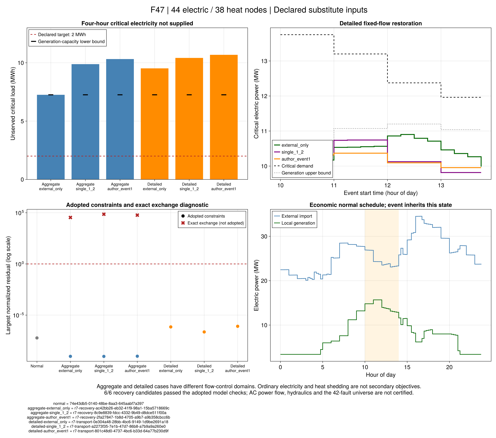

# 保供规模预运行：开关、时钟与冻结输入

本批从[空间初态](ch07-initial-profile.md)进入第7.5节44电节点、38热节点系统的预运行。
采用原图连接和设备额定值，缺失参数遵循`configs/r9/resilience-protocol.toml`。
它是**论文规模拓扑上的显式替代输入**；负荷分配、线路参数、故障全集和成网能力均不称为作者原始数据。

## 1. 可操作开关与强制故障

PDF139（印刷122页）图7-12的白框为线路负荷开关。本次原页局部复核还确认E20–E23白框。
采用7条基础线路开关与4条联络线；此前第7.3节冻结的6条基础开关清单、结果和判定保留原样，
两份输入不能当作只有交易目标不同的同网络实验。原图未标开关不证明现实中绝对没有开关；
“仅白框可操作”是明确的项目解释。

| 类型 | 无向端点 |
| --- | --- |
| 基础线路开关 | 1–2、1–7、1–13、1–39、20–23、20–26、20–28 |
| 常开联络线 | 6–38、18–27、25–24、19–33 |

设``z_l^0``为原机械状态、``\gamma_l``为故障、``a_l^+,a_l^-``为主动合/分闸、
``\mathcal S``为显式开关清单，保留原R7-R1并增加

```math
z_l=z_l^0(1-\gamma_l)+a_l^+-a_l^-,\qquad
a_l^+=a_l^-=0\quad(l\notin\mathcal S).
\tag{R9-RW1}
```

故障仍能强制断开不可主动操作的线路；保护开断不收主动动作次数。旧输入不声明新清单时
保持全部健康线路可操作的旧域。建模、固定模式可用性、LP故障参数行、独立验算均执行此约束。
符号故障LP不能按零故障先排除某个模式，否则会漏掉只在真实断线后可用的模式。

三节点解析例在同一故障下，允许联络线合闸时失供为0；禁止该动作时为1.2 MWh。
这用于检验可操作域，不是44节点系统的重构收益。

## 2. 共同时间网格与关键负荷

正常与恢复均采用15分钟网格。项目小时曲线保持每小时内常数，小时电量不变；
启停动作费不乘步长，运行费用和失供积分乘步长，爬坡乘小时步长，最短启停时长换算为步数。
事件1采用原文字与表均出现的半开窗口``[10,14)``，对应第41至56步；
其余原文窗口冲突保留，不拼接成一个声称来自作者的事件表。

```math
t_s=1+10/0.25=41,\qquad N_s=(14-10)/0.25=16,\qquad
E_{\mathrm{uns}}=0.25\sum_{t=41}^{56} P^{\mathrm{critical,shed}}_t.
\tag{R9-RW2}
```

图7-12和图7-14关键节点集合分别生成。每套13.75 MW在其节点内等分；共同总负荷取两套逐节点
较大值再分配剩余需求，总峰值为45.67 MVA×0.9=41.103 MW。这是同峰与分配假设。
两套分类共用全部物理电热需求、价格、设备与初始状态；实际关键需求按同一日曲线变化。

设备保留第7.1/7.5节额定值：CHP1为8.5 MW、CHP2为6 MW、GT为2 MW、PV为2/3/3 MW，
电锅炉按热额定功率除效率换为电输入边界。没有引入第7.3节电池或第7.2节PV扩容。
GT成本为771.3 CNY/MWh；电价用第7.1节峰平谷表，新增启停持续时间和爬坡规则独立声明。

## 3. 初态、网络与故障边界

- 热网保持固定正常参考正流，供回水初态是稳态指数空间分布；CHP2前出力由热源1实际含损耗供热量推得。
- 正常末端管温为free；本批不作周期收益排名。故障状态从同一正常运行第40步结束处继承，不能重新选择初态。
- 电网采用既有幅值线性近似和理想额定变压器；工程阻抗/容量、发电机无功容量均是显式替代参数。
- 成网根只声明22和33，分别有GT及已开机CHP；这不证明黑启动或频率动态安全。
- 六条候选故障线取原图红标与事件1示例的并集，最多3条是项目设定，共42个子集。
- 三个预运行：仅外网中断、另断1–2、另断原示例1–7/1–44/44–20。所有恢复的PCC交换为零。
  因而`external_only`不是正常无故障运行；完整联网基准是`normal`。

每个恢复输入先保留关键、普通电负荷及热失供的独立账本。聚合双水箱与给定参考流的详细逐管恢复
分别运行；二者控制域不同，费用/失供差不直接归因于单一热模型近似。后续自由流量或同控制比较需独立声明。

## 4. Julia入口与可重复执行

```@index
Pages = ["ch07-resilience-pilot.md"]
```

```@docs
with_r7_switch_control
r9_resilience_template
```

```sh
julia +1.12.6 --startup-file=no --project=. scripts/test_r7_switch_control.jl
julia +1.12.6 --startup-file=no --project=tools/solvers scripts/test_r7_switch_control_gurobi.jl
julia +1.12.6 --startup-file=no --project=. scripts/test_r9_resilience.jl
julia +1.12.6 --startup-file=no --project=. scripts/check_r9_resilience_pilot.jl
julia +1.12.6 --startup-file=no --project=. scripts/r9_resilience_study.jl freeze results/runs/new-resilience-input
julia +1.12.6 --startup-file=no --project=tools/solvers scripts/r9_resilience_study.jl run results/runs/new-resilience-input results/runs/new-resilience-pilot nodes_figure_7_12 normal
```

先冻结，再用同一输入分别运行`aggregate-external_only`、`aggregate-single_1_2`、`aggregate-author_event1`，
以及对应`detailed-`阶段。每次完整运行600秒，包含加载、构建、继承、验算和保存；正常优化截止420秒、
恢复优化截止480秒，余下用于独立检查和存档。不自动覆盖、改参、换模型或重试失败运行。

`check BUNDLE`只核对冻结字节与当前源码；它不代替各运行自带的`code/replay.jl`数值重验。
模型测试、输入构造测试和规模预运行的状态分别记录；规模结果以任务记录与后续结果表为准。

## 5. 验收与后续研究问题

先检查正常调度、事件继承及三故障的构建/求解/回放时间，保存不可行、超时和验证失败。
只有限定流量模型的候选通过时，才报告该域的失供及有效界；3个故障不认证42个全集。
随后比较4A经济、4B关键失供惩罚、4C失供上限，且分别关闭电网重构与热网灵活性。
本批开关和初态准备、乃至少量故障成功，都不代表第7.5节完整算法或全文目标已完成。

## 6. 本次七项规模结果与解释

2026-09-22执行`nodes_figure_7_12`分类的一项经济正常调度及六项恢复，全部使用v2冻结输入。
第二套图7-14分类仅冻结，尚未求解。七项完整运行均在600秒内，实际35.22–53.62秒。
原值、随附科学源码、事件继承及图源表保存在`results/summaries/r9-resilience-evidence-20260922-v2/`。
v1原值保留；v2为同七项运行的报告修订，明确区分采用约束与精确交换诊断，未重新优化。
运行身份和未舍入值以`summary.csv`为准。

正常成本为 **497483.597874 CNY/日**：购电412050.435725、资源85433.162148、启机0。
独立正常模型、费用和完整管温回放均通过；给定正常流量模型的相对间隙为0.009049827%。
它是条件经济基准，不是完整可变流量规划的最优费用。

| 故障窗口[10,14) | 聚合模型关键失供/MWh | 固定流详细模型关键失供/MWh | 2 MWh目标 |
| --- | ---: | ---: | --- |
| 仅外部电网中断 | 7.255500 | 9.521441 | 两者均未达到 |
| 外网中断并断1–2 | 9.883918 | 10.416971 | 两者均未达到 |
| 外网中断并断1–7、1–44、44–20 | 10.319838 | 10.682204 | 两者均未达到 |

六项结果均通过各自采用模型的A1检查，并取得对应恢复模型的有效最优性界。
详细模型还通过保存值的逐管水团回放。这里的“求解通过”与“保供目标达成”是两个判定：
本批全部恢复候选合格，但全部超过预设关键失供目标。不能把有负荷削减的合格解写成全部供能成功。
普通电负荷失供约99.40–102.03 MWh，热失供约1.14–2.95 MWh，逐项原值保留；
二者没有二级最小化目标，不能把其排序解释成最优普通负荷或热舒适性能。

三项聚合解的精确循环交换式（6-88）均未通过：最大功率差分别为0.964128、2.006597、1.632329 MW。
这些行在原验证器属于`exact_exchange`诊断，不能与`adopted`约束的通过状态合并。
它们证明当前聚合候选没有取得精确交换关系的认证。给定流量逐管模型另行求解并验证，
也不能视为保持同一控制量对原聚合解完成了可行重构。

### 容量原因：一个独立于恢复优化器的下界

正常调度在整个事件窗口令CHP1停机、CHP2开机。灾后继承该启停计划；本批没有重新启动停机CHP的决策。
仅从电平衡与发电上界出发，忽略电锅炉耗电、普通负荷、网络约束、热耦合和爬坡限制，得到更宽松的能力上界：

```math
\overline P_t=\sum_{g\in\mathrm{CHP}}u_{g,t}P_g^{\max}
+\sum_{g\in\mathrm{GT}}P_g^{\max}
+\phi\sum_{g\in\mathrm{PV}}P_{g,t}^{\mathrm{avail}},\qquad
E_{\mathrm{crit,uns}}\geq\Delta t\sum_t
\left[P_t^{\mathrm{crit}}-\overline P_t\right]_+.
\tag{R9-RW3}
```

符号``[a]_+=\max(a,0)``，``u``是继承的CHP启停，``\phi=0.4``是冻结新能源降额。
该下界只用于无电池、外部电网完全中断的当前事件，允许把全部发电优先供给关键电负荷。
按15分钟逐步计算：关键用电51.2875 MWh；CHP2最多24 MWh、GT最多8 MWh、PV最多12.032 MWh，
合计最多44.032 MWh，因此**即使忽略网络和供热限制，仍至少缺7.2555 MWh**。
聚合`external_only`解与这个解析下界一致；其余故障还有额外约束影响。
解析测试另外覆盖逐时不足与跨时总量差的区别，不能把后者误作前者。

这是对当前正常启停计划的必要条件。它支持“需要灾前保供安排”的判断，
不证明提前开CHP1后一定可行，也不证明作者算例具有同样缺口。
R9-RW3的实现与测试分别为`scripts/r9_resilience_evidence.jl`的`capacity_certificate`及
`scripts/test_r9_resilience_report.jl`。台账中将它明确登记为项目补充推导。

### 图表和只读复核



F47附完整运行ID、MW/MWh单位、图源CSV和哈希；圆点为采用约束，叉号保留失败的精确交换诊断。
初版图将纵轴上限固定为2，误裁掉该诊断的三个高残差点；原图保留，本文使用已修正完整范围的v2。
图中两种热模型的流量控制域不同，
差额只能称为组合差异。A1通过的范围仍为声明的线性电网和相应热模型，未认证交流电网、水压动态或黑启动。

```sh
julia +1.12.6 --startup-file=no --project=. scripts/test_r9_resilience_report.jl
julia +1.12.6 --startup-file=no --project=. scripts/r9_resilience_evidence.jl check results/summaries/r9-resilience-evidence-20260922-v2 --replay
julia +1.12.6 --startup-file=no --project=docs scripts/plot_r9_resilience.jl results/summaries/r9-resilience-evidence-20260922-v2 results/runs/new-resilience-figures
```

完整批次可在先完成`normal`的新运行目录调用`scripts/run_r9_resilience_batch.jl INPUT OUTPUT KEY`。
它逐项启动独立Julia进程，已有日志或管道错误会停止后续编排，科学失败状态则按原记录保留。
`freeze INPUT RAW KEY NEW_EVIDENCE`仅封存现有结果；`check --replay`用随附源码移位重验，不重新优化。

### 下一批顺序

1. 沿同一输入、窗口和故障，建立4A经济、4B关键失供罚费、4C失供上限的灾前共同规划对照。
2. 分别核查是否提前开机、是否改变初始热状态、费用增加多少以及关键缺供是否真正降低。
3. 控制同一流量与启停条件后再评价热代理差异，再扩大到42故障和第二套关键节点分类。

作者第7.5节完整保供方法、自由流量规划和全文复现均未完成。本批完成的是规模条件基准及容量反例。
