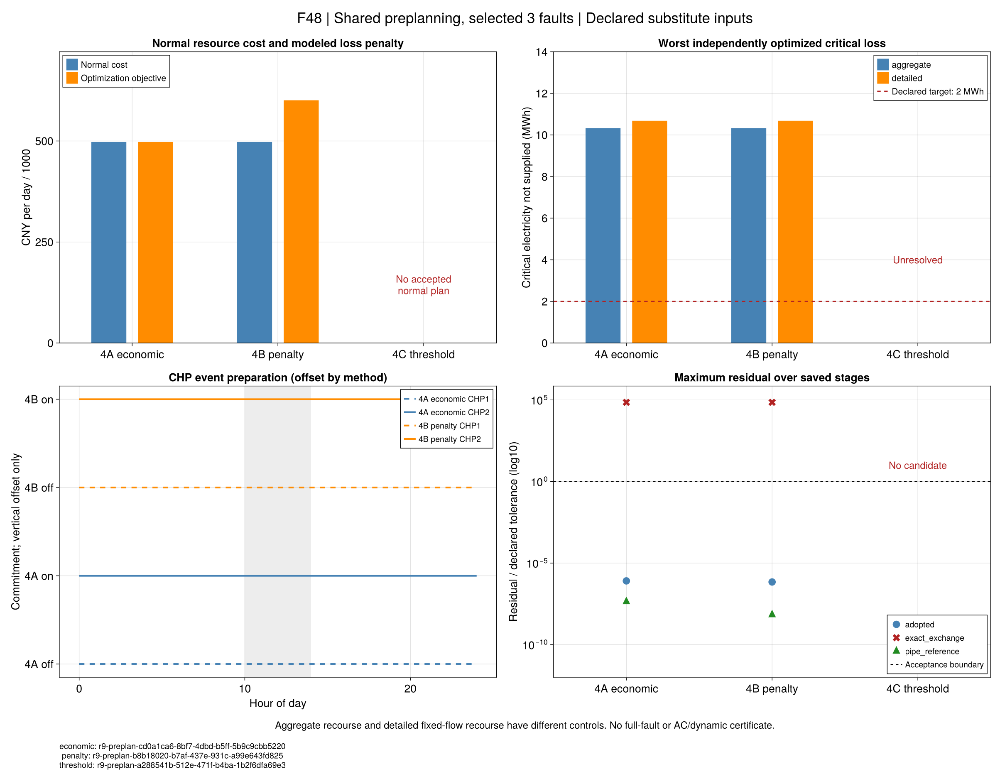

# 灾前准备：经济、罚费与保供门槛

[七项规模预运行](ch07-resilience-pilot.md)表明：在经济调度继承的CHP启停下，
关键用电51.2875 MWh，而发电上限仅44.032 MWh。线路重构不能增加这个容量上限。
本节点让正常调度提前考虑恢复能力，比较同一输入下的费用与关键失供。
第7.5节4B文字/启停表标签有冲突，详见来源RS04；以下是明确的采用解释，不冒称作者源码。

## 1. 共用什么决策？

令``x``包含正常期CHP启停、设备出力和完整管温轨迹，``y_{sf}``是事件``s``、故障``f``的恢复决策。
``\mathcal F_s^*``是本次**显式纳入的故障子集**，``\mathcal Y_{sf}(x)``继承同一``x``的窗口启停、
事件前出力与热状态。正常管流和电网拓扑保持原预运行输入。

```math
x\in\mathcal X_{\mathrm{prescribed}},\qquad
y_{sf}\in\mathcal Y_{sf}(x),\qquad
L_{sf}=\Delta t\sum_{t,\omega}p_\omega P^{\mathrm{critical,shed}}_{sf,t,\omega}.
\tag{R9-RP1}
```

``L``单位MWh，``\Delta t``为小时；新能源场景概率``p_\omega``只在原期望失供中使用。
故障不共用恢复开关或设备出力，不能按故障分别挑选不同的灾前CHP计划。
正常仍为给定正流量的连续逐管输运参考，恢复见证采用既有聚合模型及源/荷温差界。
不会因为已有R8接口而悄然换成Gauss共同流量表示。

## 2. 三个目标及上图变量

4A只最小化正常费用``C(x)``，不在主问题增加恢复块；随后再独立评价。
4B为每个事件增加上图变量``\zeta_s``，表示本子集内最坏期望失供：

```math
\min_{x,y,\zeta}\ C(x)+\rho\sum_s\zeta_s,
\qquad \zeta_s\ge L_{sf}\quad(f\in\mathcal F_s^*),\qquad
0\le\zeta_s\le\overline E_s.
\tag{R9-RP2}
```

``\rho=10000`` CNY/MWh取先前冻结协议；``\overline E_s``为该事件关键电需求总量。
同一事件三个故障互为可能发生的情况，不能对三个失供简单求和。多个事件的求和沿采用口径，
没有补造事件发生概率。正常费用、罚费及总目标分别保存；总目标下界不能用作正常成本下界。
罚值为零时，存在的恢复硬约束仍需满足，不能普遍宣称与没有恢复块的4A可行域相同。

4C要求每个纳入故障都有门槛内的恢复见证，再最小化正常费用：

```math
\min_{x,y} C(x),\qquad L_{sf}\le\overline L_s\quad(f\in\mathcal F_s^*),
\qquad \overline L_s=2\ \mathrm{MWh}.
\tag{R9-RP3}
```

4B的独立载体将策略门槛放到关键需求总量，使罚值发挥作用；4C使用2 MWh门槛。
载体规则及哈希单独保存，原正常输入、原事件规格及已保存运行均不改写。
4C见证只证明存在可接受的恢复，未必最小化该故障失供；4B非最坏故障的见证同样可能不最优。

## 3. 怎样判断准备有效？

从新正常候选重新生成事件，并分别求解三个聚合恢复和三个固定参考流的详细恢复。
记录启停改变、正常费用分项、事件前完整管温、最小关键失供及有效界。
独立恢复不回写正常计划，也不能临时启动灾前计划中关机的CHP。

判定分为：正常模型/管温回放、恢复见证、独立聚合、精确交换诊断、详细逐管回放与2 MWh门槛。
普通电负荷和热失供仍单列，没有二级优化时不解释其最优排序。
本批三故障不能认证42故障全集；聚合与固定流详细的控制域差异不作单一热模型收益。
正常末端仍为free，不作周期经济收益结论；AC电网、黑启动及完整水力动态仍未认证。

## 4. Julia接口与测试

```@index
Pages = ["ch07-resilience-preplan.md"]
```

```@docs
r9_preplan_spec
build_r9_preplan
solve_r9_preplan
validate_r9_preplan
save_r9_preplan
read_r9_preplan
```

```sh
julia +1.12.6 --startup-file=no --project=. scripts/test_r9_preplan.jl
julia +1.12.6 --startup-file=no --project=. scripts/check_r9_preplan.jl
```

解析测试使用原四时段储能案例，检查按故障取max而不是sum、零罚值退化、储备费用、
子集覆盖、原费用/罚费/目标界分离、硬不可行、状态继承以及保存后移位重读。
测试通过只支持接口和采用方程实现，不预先证明本次规模4B/4C有效。实际实验另按任务记录登记。

## 5. 冻结后执行

`configs/r9/preplan-study.toml`在新规模优化前固定：仍使用原图7-12分类及三个故障。
每种方法独立进程，从加载开始共600秒；主阶段截止240秒，六项恢复共享至540秒，
每项最多60秒且按剩余预算均分，最后预留检查/保存。可用时间耗尽的阶段记录未决。
新4A同构造器对照不注入原经济解；原经济基准仍原样保留。

```sh
julia +1.12.6 --startup-file=no --project=. scripts/r9_preplan_study.jl freeze results/runs/new-preplan-input
julia +1.12.6 --startup-file=no --project=. scripts/r9_preplan_study.jl check results/runs/new-preplan-input
julia +1.12.6 --startup-file=no --project=tools/solvers scripts/r9_preplan_study.jl run results/runs/new-preplan-input results/runs/new-preplan-output penalty
```

将末参数显式换为`economic`或`threshold`执行其他方案；每个方法目录只能生成一次。
三种方案使用同一冻结正常输入和故障，无参考解注入，无优化后调参。
VS Code对应任务提供测试、映射、冻结、只读检查及完整方法运行入口。

## 6. 本批结果：罚费没有降低最坏失供

冻结输入为`r9-preplan-input-20260922-v1`，仍为44电节点、38热节点、96个15分钟正常时段，
事件为[10,14)，仅纳入`external_only`、`single_1_2`和`author_event1`三个故障。
逐节点分配等缺失数据使用已声明的替代规则，不是作者同输入数值复现。

| 采用方案 | 正常费用（CNY/日） | 聚合最坏关键失供（MWh） | 固定流详细最坏关键失供（MWh） | 状态 |
|---|---:|---:|---:|---|
| 4A 经济 | 497483.597874 | 10.319838 | 10.682204 | 正常与六项恢复通过各自采用模型 |
| 4B 罚费 | 497483.597874 | 10.319838 | 10.682204 | 正常与六项恢复通过各自采用模型 |
| 4C 门槛 | 未取得 | 未运行 | 未运行 | 正式运行返回`solver_infeasible_or_unbounded` |

4B罚项为103198.384019 CNY，总目标600681.981893 CNY。它不是增加了同额真实燃料消耗；
正常资源/购能费用与失供罚费必须分开解释。4A和4B均为CHP1全天关机、CHP2全天开机。
4B总目标上下界在数值精度内一致；4A费用相对间隙约0.00905%。这些界限于各自采用模型。

三个故障逐项独立最小失供为：

| 故障 | 4A聚合（MWh） | 4A固定流详细（MWh） | 4B变化 |
|---|---:|---:|---|
| 外网中断，内部无额外故障 | 7.255500 | 9.521441 | 仅数值舍入差 |
| 额外断开1–2 | 9.883918 | 10.416971 | 仅数值舍入差 |
| 采用的作者事件1故障 | 10.319838 | 10.682204 | 仅数值舍入差 |

**采用模型通过不等于2 MWh目标通过。** 聚合模型原6-88精确交换诊断仍失败；
固定流详细恢复通过自己的逐管回放，不自动认证变流量热网、AC电网、黑启动或全部42故障。
三种完整方法分别用时93.216、119.000和34.087秒，均在原600秒预算内。



F48读取封存表，不重新求解。4C没有候选，以缺失状态显示，不绘成零费用或零失供。
图中4C保留正式运行的未决状态；下述独立诊断另行给出证据。

## 7. 独立诊断：区分开机能力、费用权衡和可行域

两组诊断先保存各自协议与源码，各共享180秒，实际分别45.714和71.327秒。
它们不是正式方案的重跑替换，候选也没有注入4A/4B/4C。

1. **状态消歧。** 对同一4C模型重新构建，设置`DualReductions=0`后返回`infeasible_certified`。
   原正式运行仍保留`solver_infeasible_or_unbounded`。
   这是求解器的同模型不可行证据，不是手工解析证明。处理依据见
   [Gurobi状态说明](https://support.gurobi.com/hc/en-us/articles/4402704428177-How-do-I-resolve-the-error-Model-is-infeasible-or-unbounded)。
2. **只考察正常期开机。** 最大化事件中CHP1的开机时段数，达到16/16，
   正常方程和逐管回放均通过。费用557055.755723 CNY只属于该可行候选，未最小化费用。
   因而“正常模型根本不允许CHP1开机”的解释已被排除。
3. **只最小化最坏失供。** 保留共同正常决策、三个恢复块和全部原约束，去掉费用目标，求解：

```math
\min_{x,y,\zeta}\ \sum_s\zeta_s,
\qquad (x,y)\in\mathcal F_{\mathrm{R9\text{-}RP1}},\quad
L_{sf}\le\zeta_s\le\overline E_s.
\tag{R9-RP4}
```

得到目标与下界均为10.319838401908155 MWh；正常、继承、恢复见证和目标回代通过。
费用600294.799894 CNY属于这个失供最优候选，不能与4A作最小费用差比较。
这表明**在当前采用模型和所选故障中，单纯提高罚值不能把最坏失供降到2 MWh**。
结论依赖同模型有效界，并非对真实系统的容量不可能性证明。

4. **固定CHP1在事件中全开，再最小化原4B目标。** 得到合格共同规划，
   正常费用503527.775614 CNY，比原4B增加6044.177740 CNY；最坏失供仍为10.319838 MWh。
   该受限问题目标606726.159633 CNY与下界数值一致。它排除了“共同规划一开CHP1就必然不可行”，
   但没有证明其他故障的独立最小失供均不受益：这里优化的是故障中的最大值。

当前能解释4B为何保持原承诺：它已经达到本采用域的最小最坏失供，增加上述开机承诺只提高费用。
**还不能解释10.319838这个下界究竟由哪条网络、端口或继承关系造成。** 需要进一步提取约束证据，
不能把“结构限制”未经核查地指定为某条线路或某个热模型。

### 7.1 已保存开机候选的逐故障评价

继续使用上述事件16步全开CHP1、正常费用503527.775614 CNY的**同一个已保存候选**，
不重新优化灾前计划。新运行`r9-preplan-faults-20260922-v1`按原故障、初始完整管温与固定流量
独立求解六项恢复，共55.528秒，原600秒预算不变。

| 故障 | 原4B聚合关键失供（MWh） | 全开候选聚合关键失供（MWh） | 全开候选固定流详细恢复 |
|---|---:|---:|---|
| 仅外网中断 | 7.255500 | 0.000000 | 求解器判不可行，无调度候选 |
| 额外断开1–2 | 9.883918 | 9.447932 | 求解器判不可行，无调度候选 |
| 采用的作者事件1 | 10.319838 | 10.319838 | 求解器判不可行，无调度候选 |

三个聚合候选通过各自采用模型；这表明最坏值不变会掩盖非最坏故障的改善。
它们的原6-88精确交换诊断均未通过，该诊断与采用模型通过分别保留。
对照同时改变了重新优化后的灾前出力、热状态等，不能将全部差异归为单独启停的因果效果。
三个详细模型的`infeasible_certified`是该固定流量及继承条件下的求解器结果；
不是零失供，不证明任意变流量或其他灾前状态都不可行。
六项正式评价本身只给出状态；其后的独立开发诊断已定位下节所述温度冲突。

因此应分别回答“非最坏故障是否受益”“最坏故障的限制是什么”“该计划在详细热网下能否实施”。
聚合零关键失供不能直接作为已实现保供；也不意味着普通电负荷和热负荷均零失供。
上述新记录不替换原4A/4B运行、4C诊断或失供下界证据。

### [7.2 继承热状态的具体冲突：开发诊断](@id r9-handoff-counterexample)

对上述“仅外网中断”的同一个详细模型提取冲突约束，得到管37（37→38）第三子步
出口温度必须为343.06151011413453 K，而其下界为343.15 K。这两行自身即不相容。
独立水团回放复核了数值；改变灾后入口控制仍不能改变首15分钟的出温，因为该管输运时间为20分钟。

| 检查对象 | 数值（K） | 与343.15 K下界的关系 |
|---|---:|---|
| 原正常模型的15分钟出口平均 | 343.150000 | 合格 |
| 详细恢复的第三、第四个3.75分钟子步出口平均 | 343.061510 | 低约0.088490 |
| 同一15分钟边界的管内最低温度 | 343.061510 | 低约0.088490 |

最后一行在粗、细时间回放中一致。因此问题涉及**正常平均温区与详细时空温区的差异**，
不能仅称为时间离散误差，也不能靠改回15分钟步长宣称解决。
在给定初态和流量下，以全下界/全上界入口分别回放形成温度必要条件：
原经济状态没有这种冲突，新开机状态有八条温区冲突。通过该预检仍不证明设备、网络和供热调度可行。

IIS运行位于`results/runs/r9-detail-conflict-20260922-v2`；单管回放v2七项、
全网必要温区开发检查v2十项通过。它们尚未进入7.1的正式封存包；首次诊断及测试夹具错误均保留。
这是项目采用模型之间的相容性证据，不是作者公式错误的证明，也不解释10.319838 MWh的电力最坏失供下限。

接续已单独封存为`results/summaries/r9-handoff-evidence-20260922-v1`，不改7.1的旧包。
[详细灾前规划](ch07-resilience-detailed.md)已用显式新版本接入详细恢复条件：
新罚费候选三故障可行，最坏失供10.552191 MWh；2 MWh门槛仍为采用域内不可行。
详细范围、费用取舍和F49见该页，历史开发判定保持。

## 8. 与原文比较及下一步

原文表7-19正常费用为4A/4B/4C的405373、418616、409662 CNY，显示作者输入下的方案有费用差异；
原标签、时钟和关键节点冲突仍按`docs/reading/ch07/resilience-review.toml`中的RS02–RS06保留。
本批共同输入下尚未得到作者报告的保供改善。该差异支持继续检查模型/输入边界，不能推出作者结论错误。

以下为原节点的推进顺序；第1项已由上述详细规划节点完成，当前继续第2项：

1. 封存已定位的继承温度反例；核对采用边界后，将必要的子步及空间温区条件接入灾前决策，
   使用显式新版本复验同输入、同故障，保留原平均模型及原结果。
2. 从最坏故障的活跃约束提取局部供能/网络割集或端口限制，争取得到可手算、可独立验证的下界解释。
3. 将限制逐项对回原式、作者资料与项目新增规则。仅对有理论和来源依据的修正建立新版本；
   不为降低失供而反向调负荷、容量、罚值或A1阈值。
4. 先完成原因归档，再决定第二关键节点分类、完整故障覆盖及消融的必要性。
   三个子集已不能满足门槛时，不把遍历更多故障当作修复手段。

本批完成的是**给定正常流量、所选故障的灾前规划对照及负结果定位**；R9/R10和全文复现仍未完成。

## 9. 证据重读

`results/summaries/r9-preplan-evidence-20260922-v1`保存三方法原值、源码及图源表；
`r9-preplan-diagnostics-20260922-v1`独立保存两组诊断及`diagnostics.csv`。
两个包均可移位解包并使用自己的冻结源码重验，无须原`results/runs`目录或重新优化。
补充的`r9-preplan-faults-20260922-v1`保存逐故障对照、原4B基准、父诊断和六项原恢复，
其中不可行状态与数值缺失保持原样；其检查入口独立于上述两个历史包。

```sh
julia +1.12.6 --startup-file=no --project=. scripts/r9_preplan_evidence.jl check results/summaries/r9-preplan-evidence-20260922-v1 --replay
julia +1.12.6 --startup-file=no --project=. scripts/r9_preplan_diagnostic_evidence.jl check results/summaries/r9-preplan-diagnostics-20260922-v1 --replay
julia +1.12.6 --startup-file=no --project=. scripts/r9_preplan_fault_evidence.jl check results/summaries/r9-preplan-faults-20260922-v1 --replay
julia +1.12.6 --startup-file=no --project=docs scripts/plot_r9_preplan.jl results/summaries/r9-preplan-evidence-20260922-v1 results/runs/new-preplan-figures
```
