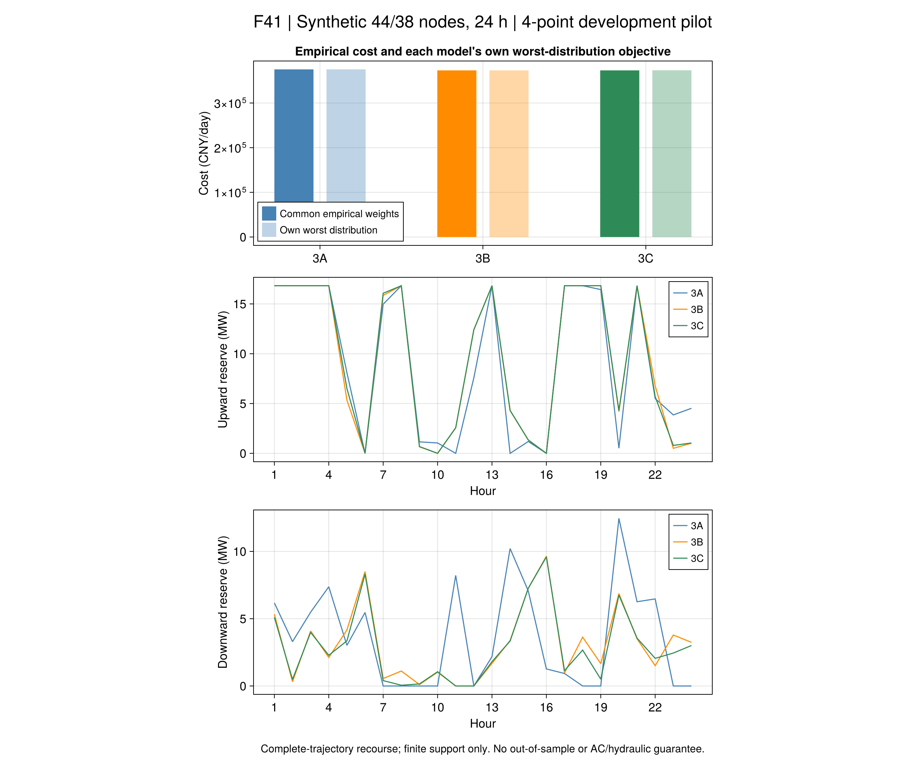
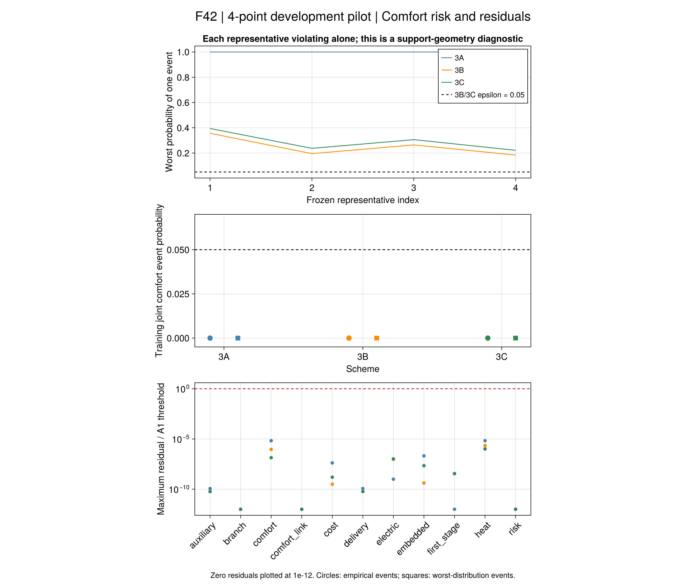
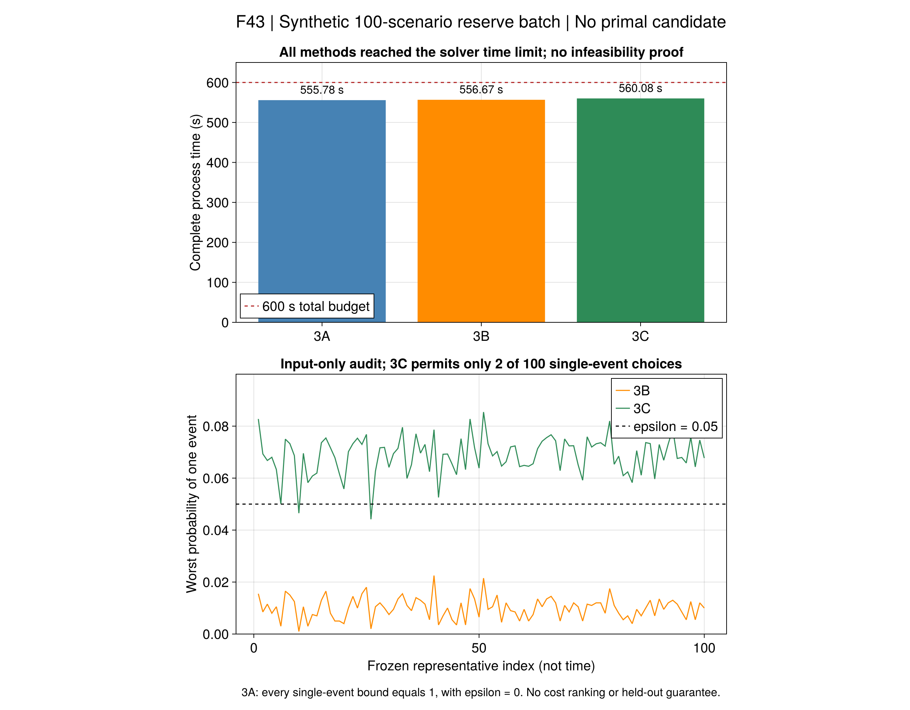

# 第7.4节：备用风险预运行与100情景规模检查

本批将[共同备用输入](ch07-reserve.md)接入三种风险模型，
按[事前规则](ch07-risk-study.md)冻结训练数据、代表、交付门槛和代码。
**4情景闭环通过；100情景三项均在既定预算内超时、无候选。**
全部为合成替代输入，不是作者同输入复现。

## 1. 预运行说明了什么

100个训练代表的冻结顺序不变，开发预运行只取前4个并重标训练频数。
它保持44电/38热节点、36栋建筑及24小时，缩小的是情景数。
三方案统一严格交付，未用交付误差抵消备用承诺；各候选通过采用模型、风险、费用和有效间隙检查。

| 方案 | 经验净费用 CNY/日 | 自身最坏净费用 CNY/日 | 备用容量时数 MW·h | 最坏舒适事件概率 | 完整进程秒 |
|---|---:|---:|---:|---:|---:|
| 3A | 375255.067587 | 375255.067587 | 302.175495 | 0 | 132.64 |
| 3B | 373029.203868 | 373029.203868 | 297.649246 | 0 | 137.41 |
| 3C | 373038.779456 | 373241.545912 | 293.332078 | 0 | 121.27 |

“备用容量时数”是上下备用铭牌承诺分别乘时间后求和，不是实际交付能量。
实际调用、交付与误差保存在每情景原值中。三个目标的最坏分布不同，
不能把最坏目标相减解释为共同实际分布下的收益。
3A中某些非最坏情景的调度费用未被唯一最小化，经验费用也不能替代统一执行规则下的样本外比较。

四个代表各自的经验概率均大于5%。因此3B也不允许任何一个完整日被选为舒适违约情景；
本预运行没有展示“牺牲少量舒适性换取更多备用”的机制。其正面证据是相同物理输入下
三种有限支持风险模型与独立验算能够闭合，而不是机会约束收益已经得到证明。





## 2. 100情景与计算规模

数据为独立冻结的2000训练日、500验证日和1000测试日。只用训练集形成100代表；
验证和测试优化尚未执行。每项正式方法共享600秒，含读取、建模、求解、验算及保存。

| 方案 | 终止状态 | 原始候选 | 完整进程秒 | 600秒预算 |
|---|---|---|---:|---|
| 3A | TIME_LIMIT | 无 | 555.78 | 通过 |
| 3B | TIME_LIMIT | 无 | 556.67 | 通过 |
| 3C | TIME_LIMIT | 无 | 560.08 | 通过 |

3A的下界303371.650718CNY不是可行调度费用，没有可计算的有效相对间隙。
三项均不能报告费用排名、交付能力或舒适通过率；不存在可供回代的原始候选。
不能用求解日志中的中间数值代替候选。

没有候选不能推出物理不可行，也不能据此判断作者算法失败。
本批采用现有直接确定性等价模型；规模计算能否闭合与小支持模型是否正确是两个验收问题。
只构建同一冻结3A模型的独立审计得到1061074个变量、2735895个约束（含变量集合）、
零二元变量；构建约89.15秒。数据读取/构建开销、求解器限制及模型条件应分开定位，不能一概归因于整数难度。
这些数量描述了计算规模，尚不是求解瓶颈的完整成因证明。

## 3. 固定半径实际允许哪些情景

若仅第``i``个代表发生事件，其他情景均不发生，则运输球内最坏概率可独立化为：

```math
q_i^{\max}=p_i+\max_{0\le y_j\le p_j}\sum_{j\ne i}y_j,
\qquad \sum_{j\ne i}d_{ij}y_j\le\rho .
\tag{R9-RS-A1}
```

按距离从小到大转移概率就是该连续分数背包的解，42项检查已与独立运输LP对照。
这只审计支持几何，不调整半径、不使用优化费用挑选样本。
若一个单事件的最坏概率已超过5%，含有该事件的联合事件也不可能满足同一风险界。
正式100代表的经验概率为0.001–0.0225，因此3B允许每一个单事件，但不表示允许同时发生全部事件。
3C的单事件最坏概率为0.044165–0.085423，仅2个代表可以单独违约；其余98个必须保持舒适。
这个结论由支持、距离和事前半径决定，不需要训练优化成功，也不证明3C的费用或样本外可靠性。



## 4. 可复核证据与工程改动

- 输入包：`results/summaries/r9-reserve-data-20260921-v1`及`v2`。
  新版仅缓存验收排序键；全部原数组、聚类、协议和六项案例身份保持一致。
- 预运行数值包：`results/summaries/r9-reserve-pilot-20260921-v2`，118项独立重验通过。
  原始变量、状态、界及独立运输见证全部保留，逐行验收由冻结验证器重算并核对规范文本SHA。
  完整原字节运行仍保留本地，公开包不冒称其逐字节镜像。
- 正式负结果包：`results/summaries/r9-reserve-full-20260921-v1`，118项重读通过。空费用/轨迹/残差表表示没有候选，
  不是零费用或零残差；求解器状态、界、预算及输入身份仍完整保留。
- SHA使用同一UTF-8字节的IOBuffer，避免本机字符串别名检查开销；输入摘要不变。
  验收排序缓存同一文本键，完整22666784字节规范文本摘要不变。性能修复没有改变方程、数据或验收门槛。

```sh
julia +1.12.6 --startup-file=no --project=. scripts/test_r9_reserve_freeze.jl results/summaries/r9-reserve-data-20260921-v2
julia +1.12.6 --startup-file=no --project=. results/summaries/r9-reserve-pilot-20260921-v2/r9_reserve_evidence.jl check results/summaries/r9-reserve-pilot-20260921-v2
julia +1.12.6 --startup-file=no --project=. scripts/test_r9_reserve_support.jl
```

以上重读不重新优化，不需要Gurobi许可。VS Code提供冻结、运行、重验和只读重绘任务。

## 5. 与论文的关系和下一步

本批恢复了第7.4节“共同承诺—随机调用—电热补救—联合舒适风险”的研究结构。
连续调用域、真实概率及作者数据尚未取得；线性电网、固定正向流量、自由末端管温、
完整轨迹补救都是声明的采用模型边界。不能把它称为原AC/热水力或在线控制认证。

下一步先解释正式规模运行的实际限制，验证统一承诺的可行见证与相同模型的求解路径；
取得可接受训练候选并锁定后，才按事前规则进行样本外交付、舒适事件和费用统计。
不为得到原文排序而改样本、半径或容差。第7.5节保供和R10仍未完成，
第7.2节可信对偶、7.3可实施分歧点及规模分布/议价继续列为局部开放项。

后续新增[共同可行见证](ch07-common-witness.md)：同一原百情景输入的三方案均通过采用模型、
风险与费用回代，提供396812.219543CNY/日上界。该补证保留本页三项超时判定，
不是重跑后的优化结果，也不提供备用收益或样本外排名。
