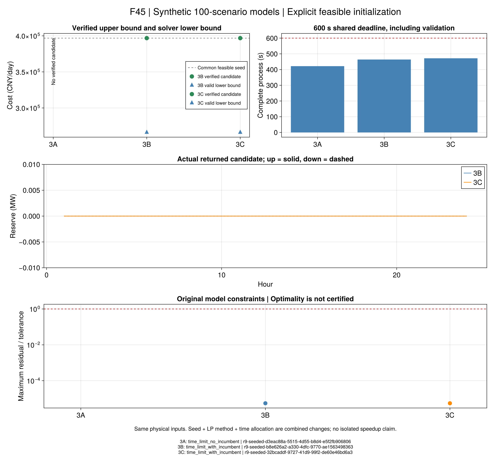

# 第7.4节：同一百情景模型的带初值对照

本节点从[已核查共同调度](ch07-common-witness.md)继续。输入仍是项目合成数据，
3A/3B/3C的原模型、100个代表情景、风险半径、价格、历史与A1/A2门槛保持。
共同调度只作为初值；原受限模型的最优性不传递给风险问题。

## 为什么还需要优化

共同调度的费用上界为396812.219543 CNY/日，但它放弃实际光伏和备用。
优化要回答：同一可行域内是否能利用这些资源降低最坏费用，以及实际候选与有效下界相距多远。
若求解器仍无候选，原共同见证仍单独保留，不冒充本次优化返回值。

把共同原值映射到完整原模型的变量，只设置起点：

```math
x^{\mathrm{start}}=\mathcal M(u^{\mathrm{common}}),\qquad
\min_{x\in\mathcal F_k} C_k(x),\qquad k\in\{3A,3B,3C\}.
\tag{R9-WS1}
```

``\mathcal M``包含每情景设备、网络、共同承诺、舒适开关及运输对偶的映射；
``\mathcal F_k,C_k``完全沿用原冻结风险模型。没有添加零备用/零PV等式，也没有固定原初值。

## 事前求解口径

- 3A是固定全零舒适开关的LP，原生`PStart`配`Method=0`、`LPWarmStart=2`。
- 3B/3C使用原MILP与原生`Start`。传值后逐值读回，另查完整JuMP模型行残差。
- 每项从导入前开始计600秒；建模、映射与优化最多用前420秒，独立运输检查到480秒，
  余下用于原物理/风险/费用验算及保存。各项使用独立进程，单线程、种子23。
- 三类门槛独立：初值传入；求解器返回实际候选；候选通过原验证器。
  每项分别记录预算、候选、最坏费用、同模型界、间隙和终止状态。

该选择遵循[Gurobi官方初值说明](https://docs.gurobi.com/projects/optimizer/en/current/features/warmstart.html)：
只有原始向量时可使用原始单纯形；MIP初值使用不同属性。
相较旧运行，3A同时改变LP方法，新候选的验算也需要预留时间。
因此本批是求解路径的组合对照，不单独证明“初值带来多少倍加速”。

## 哪种比较有理论依据

本批3B的分布集合只有经验权重，3C是含经验权重的运输球，3A的半径覆盖整个有限支持。
三者其他物理与交付条件相同，3A硬舒适，3B/3C有相同机会风险上限。
因此3A可行策略可用于3C，3C可行策略可用于3B；对同一策略，扩大分布集合不会降低最坏费用。
这给出**采用模型的全局最优值**关系：

```math
V_{3B}^{\star}\le V_{3C}^{\star}\le V_{3A}^{\star}.
\tag{R9-WS2}
```

该结论依赖共同输入、嵌套分布集合和风险边界。三条有限预算候选费用不必按此排序，
不符合排序首先检查费用界与求解完成程度；不能直接解释成更保守的方案更便宜或更自由的方案有害。
这也不是未知真实分布或作者原始数据上的效果证明。

## Julia接口与可重读证据

```@index
Pages = ["ch07-seeded-risk.md"]
```

```@docs
solve_r9_seeded_risk
```

科研实现为`src/algorithms/r9_seeded_risk.jl`，数学/状态测试为`test/r9_seeded_risk.jl`。
`scripts/r9_seeded_study.jl`提供先冻结、运行和只读重验入口。
每情景原变量分文件保存；全部运输原/对偶数值保留，分组摘要可以从原冻结验证器重新生成。
摘要压缩不改变A1/A2，不把大文件拆分视为科学验证。

## 正式结果与解释

33项开放专项与10项本机原生LP/MIP对照已通过；正式协议manifest为
`447a0c8f1acf34e6ed4cd82689c1c65412f7eaaf9f91c9eaebe96d75b24a3779`。
三项按事前顺序完成；没有重抽情景、更改半径或追加求解预算。

| 方案 | 实际终止 | 独立模型/风险/费用 | 可行费用 CNY/日 | 同运行下界 CNY/日 | 有效间隙 | 完整秒数 |
|---|---|---|---:|---:|---:|---:|
| 3A | 超时无候选 | 无新候选可验 | — | 无有信息的界 | — | 421.80 |
| 3B | 超时有候选 | 三项通过 | 396812.219543 | 266043.263018 | 32.9549% | 463.94 |
| 3C | 超时有候选 | 三项通过 | 396812.219543 | 266043.263018 | 32.9549% | 471.73 |

3A初值全部原行通过、原生PStart逐值读回，但331.12秒优化仍超时无候选。
原始返回的`-1e100`保留，表中不把它展示为有信息的经济下界。
原共同见证不改判，不能将PStart读回说成求解器已经返回可行调度。
原优化包装器会关闭详细求解输出，本轮保留的日志不足以追踪初值的内部处理；
这里以原生属性读回、实际返回状态和独立回代分别作为证据，不推断其内部接受过程。

3B/3C各100情景、2187906项原残差检查通过，最大残差/容差为``5.5194\times10^{-6}``。
这两条候选的上下备用绝对值最大仅``9.5513\times10^{-14}``MW，最坏舒适事件概率为0。
费用与初值一致，没有可核查的改善；差额上下界尚约13.08万元/日。
因此本轮确认“采用显式初值的本次MILP运行返回了合格候选”，不支持备用经济收益、方案优劣或最优性完成。
3A与3B/C求解类别不同，不能据此断言整数模型一般比线性模型容易。

模型仍是线性电网、固定正流热核、连续CHP、完整未来轨迹补救；不认证原交流/热水力或在线控制。
未开展本批样本外优化，不能把训练零事件解释为真实违约概率为零。

### 证据、重读与图表

原记录位于`results/runs/r9-seeded-20260921-v1`，公开原数值包为
`results/summaries/r9-seeded-evidence-20260921-v1`。配对原共同输入和新协议包即可重读，
不需要本地`results/runs`。移位重验与篡改/假成功拒绝9项通过：3A核验负状态，3B/C重算全部原情景。

```sh
julia +1.12.6 --startup-file=no --depwarn=error --project=. scripts/test_r9_seeded_evidence.jl results/summaries/r9-common-input-20260921-v2 results/summaries/r9-seeded-input-20260921-v1 results/summaries/r9-seeded-evidence-20260921-v1
julia +1.12.6 --startup-file=no --project=docs scripts/plot_r9_seeded.jl results/summaries/r9-seeded-evidence-20260921-v1 results/summaries/r9-common-evidence-20260921-v1 results/runs/r9-seeded-redraw-new
```



图件只读取原数值；图源表、源代码、配置哈希及运行ID一并保留。
备用展示范围为±0.01MW，避免将数值零的微小残差放大为有效备用；原值没有裁剪。
残差图通过表示采用模型约束通过，不能替代上表未通过的最优性检查。

### 不重新优化的结构审计

用原冻结系数表逐情景统计，并与3A实际模型的1061074变量/2735895约束核对一致。
其中1672800条是声明的变量上下界；单个情景的系数表还存有86688个精确零系数，
而非零系数为42452个。原成本运输行把144个非零费用项各重复100次，共1440000项。

一种后续可测的等价表示是：用求解器变量边界承载原上下界，装配时删除精确零系数，
再为每情景引入一个与原费用表达式严格相等的变量。后者的费用定义项为14500，
运输行的费用变量项为10000；其他乘子项和原物理方程不变。
这些是本轮结束时的结构计数，不能作为已证明的超时原因。
后续[等价表示验证](ch07-compact-risk.md)已开始实现与小例核查，仍未测得百情景加速。
对应只读入口为`scripts/audit_r9_seeded_structure.jl`，不申请求解器、不改变正式结果。

## 下一节点

上述等价表示的原逐行/目标映射、小例A2及日志开关正在后续节点核查，再冻结同输入同预算的规模对照。
新表示若仍受限，依据实际构建/求解数据判断已有分解入口的适用性，不原样无限重跑。
取得有意义的训练候选后再开展样本外；本批保守候选可作基线，但零备用不能展示备用交付收益。
第7.5节的保供场景可以按其独立输入继续，不要求本节先求得全部全局最优；R10和其他局部未决项保持开放。
