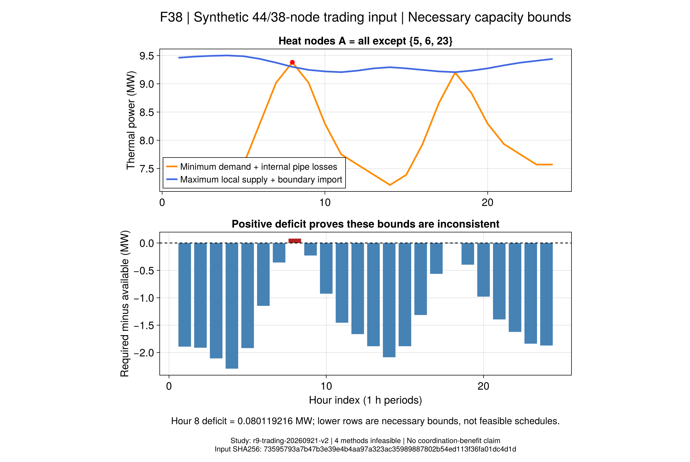

# 第7.3节规模交易：失败与容量反例

**本轮没有取得可实施的规模交易调度，但已解释一项共同失败原因。**
在冻结的替代网络中，第8时段某热网区域的最低需求与内部损耗大于其最大供热能力及跨区输入，
缺口为 **0.0801192164 MW**。此结论有独立输入推导和冻结模型精确线性证书支持。

## 1. 四方法实际结果

案例为44电节点、38热节点、8聚合商、13设备、24个一小时时段。输入仍为`synthetic`；
拓扑/设备表来自原件，缺失的网络参数、曲线和部分资源采用显式替代。
正式批次`r9-trading-20260921-v2`的输入SHA256为：
`73595793a7b47b3e39e4b4aa97a323ac35989887802b54ed113f36fa01dc4d1d`。

| 方法 | 局部计划 | 网络阶段 | 完整进程含封存/s |
|---|---|---|---:|
| independent-socp | 8/8模型检查通过 | 不可行 | 28.4571 |
| independent-exact | 8/8模型检查通过 | 不可行 | 28.2377 |
| central-socp | 集中联合优化 | 不可行 | 25.7168 |
| central-exact | 集中联合优化 | 不可行 | 25.3213 |

四项均使用同输入、自由整数控制域、同一预先冻结的Gurobi设置与600秒总预算。
独立阶段冻结各聚合商的原计划再校核网络；集中阶段可以共同改变设备和灵活负荷。
没有PG、分布式算法、议价或参考解注入。两项独立运营共16个局部计划保留原值与残差。

四项均没有网络候选，因此`model_pass=false`等标志表示没有合格调度，
并非已经测得一个候选的非零残差。不能填造系统成本、收益率或网络轨迹。
局部零售目标也不能相加充当社会资源成本。

## 2. 为什么总容量看似足够，仍会不可行？

简单地将电、热分别看成无损能量流，48项必要容量检查未发现正缺口。
这没有检查“电锅炉的电从哪里来”或“热能否送到需要它的区域”。

求解器冲突定位到第8时段。取热节点集合
`A = {1,…,38} \ {5,6,23}`，它与其余热网仅通过管道24→5连接，
该管对允许的热功率上限为0.17 MW。区域外EB3/HS1的全部额定热量不能无条件送入A。

区域内EB4位于电节点37，来自36→37馈线：

```math
P_{\mathrm{EB4},8}
\le 1.096414285714-0.628610857143
=0.467803428571\ {\rm MW}.
\tag{R9-T8a}
```

这是已经忽略非负网损的有利上界。由效率0.92，其供热最多0.4303791543 MW，
低于1 MW额定热容量。无需先求出电压、电流或热温度，就能得到此必要限制。

| 第8时段区域A的核算项 | MW |
|---|---:|
| 最低热需求（负荷已允许下调10%） | 9.0521666667 |
| 内部管对强制参考损耗 | 0.3283317040 |
| 所需供热合计 | **9.3804983707** |
| 区域内设备最大供热（含馈线限制） | 9.1303791543 |
| 跨区管道最大输入 | 0.1700000000 |
| 可提供上界 | **9.3003791543** |
| 必要缺口 | **0.0801192164** |

该上界允许储热当小时最大放热，忽略其他设备耦合、时序、无功、电压、热质量条件，
使问题更容易。即使如此仍有缺口，足以说明当前采用模型不能满足全部约束。
新增算法、更多迭代或结算价格变化均不能消除此特定容量矛盾。

## 3. 证据有多强？还不能说明什么？

1. 输入推导使用保存的Float64系数作精确有理数运算。
2. `literal-proof.toml`从冻结模型实际线性式构建加权恒等式，消去内部管道热量及EB4耗电，
   然后代入每个剩余变量的有利边界，得到完全相同的正缺口。重验不启动优化器。
3. 求解器冲突仅作为定位线索：第一次诊断因读取时限更新后的JuMP解缓存失败；
   第二次读到`CONFLICT_FOUND`及1114项包含“可能参与”的记录，两个锥类型属性不可用。
   两次均保留，独立线性证书不要求这些缺失属性通过。

冲突读取按[JuMP冲突说明](https://jump.dev/JuMP.jl/stable/manual/solutions/#Conflicts)实现。
字面证书针对本项目采用的冻结模型。它**不能证明作者输入不可行**，
不能排除当前输入还有其他瓶颈，也不能证明只修复这两个容量就一定可行。

热网仍是稳态能量/质量包络，参考损耗是项目边界；没有完整混合温度、水压或动态认证。
区域与时段是看到失败后依据冲突选择的诊断对象，明确不是预先冻结的收益筛选实验。

## 4. F38与重验入口



F38按冻结输入显示同一区域各时段的必要需求、供热上界与缺口。
它是输入约束诊断图，不是已优化调度、收敛曲线或协调收益。
公开封存位于`results/summaries/r9-trading-20260921-v1/`：
原值按内容哈希去重，超过4 MiB的文件无损分片；`summary.csv`、`stages.csv`、
`heat-cut.csv`与精确证书可核查。四个内部记录名均为`record`，由“批次＋方法ID”唯一标识。

```sh
julia +1.12.6 --startup-file=no --project=. results/summaries/r9-trading-20260921-v1/code/scripts/r9_trading_evidence.jl check results/summaries/r9-trading-20260921-v1
julia +1.12.6 --startup-file=no --project=. scripts/test_r9_trading_artifacts.jl results/summaries/r9-trading-20260921-v1
julia +1.12.6 --startup-file=no --project=docs scripts/plot_r9_trading.jl results/summaries/r9-trading-20260921-v1 NEW_FIGURES
```

重新运行科学方法必须新建批次，不覆盖本批：

```sh
julia +1.12.6 --startup-file=no --project=. scripts/r9_trading_study.jl freeze NEW_STUDY
julia +1.12.6 --startup-file=no --project=tools/solvers NEW_STUDY/code/scripts/r9_trading_study.jl run NEW_STUDY central-socp
```

## 5. 下一步

首先复核替代网络的设计口径：当前容量由基础输入设计，第7.3节新增设备与放大的负荷未必获得足够接入能力。
保留该网络作为瓶颈案例；新的容量或运行边界必须有独立设计依据、版本和预先冻结的规则，
不能根据希望看到的收益调参。单一必要冲突消失后，仍要完整回代全部约束。

来源台账还记录热联络管6—27、32—16，以及原文2B固定拓扑、2C允许重构的区别。
6—27跨越本反例的区域边界，因此它是值得单独检验的结构因素；其容量仍须有明确来源或设计规则。
目前没有启用这些管道，不能用固定树的失败推断重构方案也失败，也不能把开联络管与增容混成单因素结论。

先分别建立接入参数、固定拓扑与允许重构的可比较版本；
取得可实施集中基准和独立运营对照后，再评价协调效果与收益分配。
第7.4节价格接受型备用与第7.5节保供可以继续独立迁移；7.2的可信对偶问题单独保留。
本轮是规模输入的相容性负结果，R9、R10及全文复现仍未完成。
