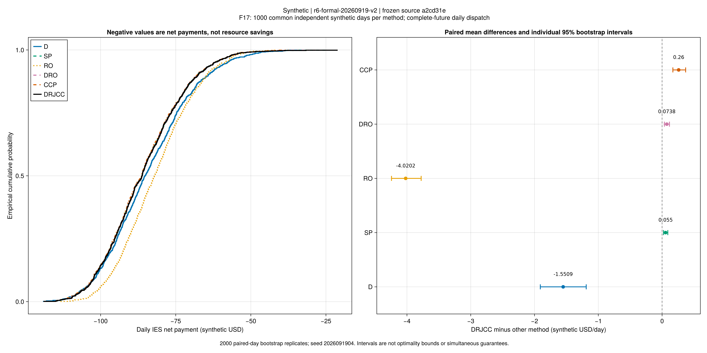
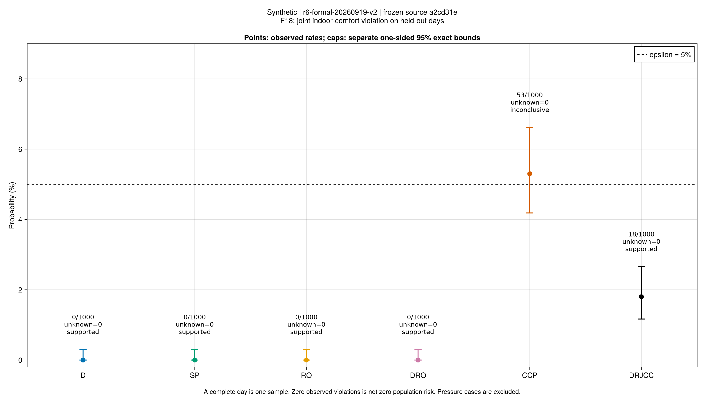
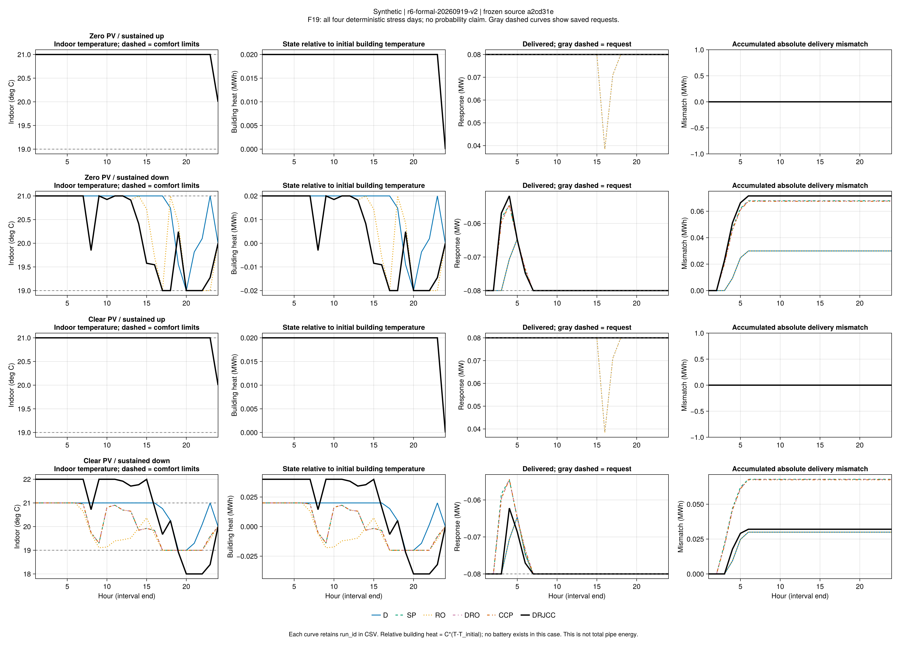

# R6：独立测试、压力边界与费用权衡

批次`r6-formal-20260919-v2`的独立测试进程已成功结束，六种已锁策略各完成1000个共同测试日。
全部6000次评价未知数为0，费用完整。策略由先前500验证日选择，测试结果未用于再选参数。
当前原值在该批次`test/<candidate>/summary.toml`及逐日目录；原冻结源码执行前后校验通过。
24项预声明压力测试也已结束；原冻结代码已重验14项训练、7000验证日、6000测试日和24压力日，
完整报告为`results/summaries/r6-formal-20260920-v1`。报告齐备不等于所有科学指标通过。

## 风险与费用

完整日是一个统计样本。风险为至少一个规定舒适条件违反的联合事件，目标上限5%。
下表上界均为按协议分别计算的单侧95%精确二项概率界，不是六方法同时保证。

| 策略 | 半径 | 违约日/1000 | 观测比例 | 风险上界 | 日均净费用（合成USD） |
|---|---:|---:|---:|---:|---:|
| D | — | 0 | 0% | 0.2991% | −83.881453 |
| SP | — | 0 | 0% | 0.2991% | −85.487349 |
| RO | — | 0 | 0% | 0.2991% | −81.412134 |
| DRO | 0.0005 | 0 | 0% | 0.2991% | −85.506162 |
| CCP | — | 53 | 5.3% | 6.6171% | −85.692343 |
| DRJCC | 0.005 | 18 | 1.8% | 2.6576% | −85.432351 |

主检验所选DRJCC的概率上界低于5%，在本批独立合成日及既定操作规则下支持该风险目标。
CCP仍为`inconclusive`：上界不能支持目标，不能仅凭样本比例5.3%就宣称已经统计证明总体风险大于5%。
零观测违约也不是总体风险为零；应保留上界。

DRJCC相对CCP少35个违约日、平均净费用增加约0.259993合成USD/日。
这与风险保护和费用之间的权衡相容，但不支持“DRJCC全面最好”：
SP零观测违约且均费低约0.054998；DRO的描述性均费又略低于SP。
完整报告按相同日配对、固定种子2026091904和2000次自助重采样，给出下列区间。
每行分别为95%百分位区间，未作多重比较校正；不是所有比较同时成立的保证或优化间隙。

| 比较：DRJCC减对照 | 平均净费用差（合成USD/日） | 配对区间 |
|---|---:|---:|
| CCP | 0.259993 | [0.169255, 0.369362] |
| SP | 0.054998 | [0.022330, 0.089723] |
| DRO | 0.073811 | [0.035856, 0.115487] |

这些区间支持本批费用差的方向，但不支持跨输入、跨操作规则的普遍排名。
费用为日前/实时净支付，可为负，数值越小越好；不能改称社会资源节约或真实利润。

## 压力日暴露了什么？

六方法乘四个确定性压力日共24项，均通过采用模型检查且费用求解完成。
其中23项舒适通过，DRJCC的`clear_pv_sustained_down`出现最大1 K舒适越界。
它们是预声明的边界轨迹，不能把23/24解释为总体可靠率，也不混入1000日的概率统计。

该失败日继承最近训练代表`train_001510`的放宽标签1；调度因此允许使用291.15–295.15 K的
物理温度域，而正常舒适域为292.15–294.15 K。保存轨迹既有上越界，也有下越界。
这解释了**模型可行与舒适失败可以同时发生**：模型允许消耗风险预算，验收仍记录真实越界。

同压力日SP匹配相同训练代表，但其标签为0且保持舒适。两策略的日前成交等决策也可能不同，
所以不能将费用差只归因于标签，更不能据此证明固定DRJCC成交后的硬舒适问题一定不可行。
本批没有用事后舒适优先调度替换这个失败记录。

DRJCC该日实际调用1.92 MWh、累计交付误差约0.032056 MWh，约为实际调用量的1.67%；
原采用式按备用容量累计量计算的误差预算为0.384 MWh。两种分母分别保存，不能互换。

## 相比验证结果，多了什么证据？

验证日用于选择半径，独立测试用于检查选定策略在新日的表现。
本次没有因DRJCC未胜过SP而重选输入、半径或舒适门槛，也没有抹去CCP的验证回退标志。
当前完成的是冻结策略在这组独立日上的统计评价，不能继承为连续分布、任意天气或部署场景的保证。

采用`r6_support_nearest_v1`：固定训练成交和选定市场价格，按最近训练代表继承舒适开关，
再读取完整未来24小时轨迹求解单日调度。这是明确的项目操作解释，不是实时在线控制。
线性电网、固定流量热网、有限支持训练及乐观市场选择等模型边界均保留。
输入仍是合成资料，因此结果不能直接否定或确认作者同输入的收益百分比。

## 这轮结果怎样评价？

1. **方法与统计闭环有进展。** 参数只由验证集选择，测试集独立；原值可回代，负结果未被替换。
2. **风险保护有条件证据。** DRJCC达到本批5%目标，比CCP少35个观测违约日，同时付出更高费用。
3. **没有证明全面优越。** SP/DRO在该分布和新日操作规则下表现更好，不能为恢复预期排名而改输入。
4. **与作者的可比范围有限。** 我们验证有限支持风险模型和机制，未取得作者同输入、真实在线策略或完整非线性网络。

这一组统计与压力证据已封存，接下来继续第6章灾前计划—故障—恢复的主线。
优先闭合CHP、电池与整管显热的事件前状态，再做可穷举小系统的分解对照。
压力日的硬舒适反事实可作为独立专题；它不阻断第6章，也不能反过来改写本批策略表现。

## 科学图与可复核材料



F17：共同1000日的费用经验分布及DRJCC减其他方法的配对均值差。
横轴左侧为较低净支付，不等同于资源节约；各区间未作多重比较校正。



F18：每个完整日计一次联合舒适事件；图中上下端分别是单侧95%界。
只有上界用于支持5%目标；CCP保留证据未定。



F19：全部四压力日的室温、建筑相对显热、备用交付和累计误差。
末行DRJCC黑线保留舒适上下越界；相同曲线自然重叠，没有添加抖动。
建筑显热不是电池或管网储能，本案例没有电池。

完整本地报告为`results/summaries/r6-formal-20260920-v1`；
可移植包为`results/summaries/r6-public-20260920-v1`，原图/图源为`results/summaries/r6-figures-20260920-v2`。
公开包重算13000日统计、选择及15组配对，并用原科学归档回代24压力日；
它没有复制随机日全部物理原值，不能把该公开重验范围扩大为随机日完整物理重验。
冻结原代码执行的本地完整报告已做后者，二者分别记录。

```text
julia +1.12.6 --startup-file=no --project=. scripts/r6_public_report.jl check results/summaries/r6-public-20260920-v1
julia +1.12.6 --startup-file=no --project=. scripts/check_r6_figures.jl results/summaries/r6-public-20260920-v1 results/summaries/r6-figures-20260920-v2
```

图源/运行ID/哈希核对通过，三图PNG视检通过，F19的PDF另经重渲染核对。
操作协议见[正式实验](r6-study.md)，新日规则见[评价定义](r6-evaluation.md)。
