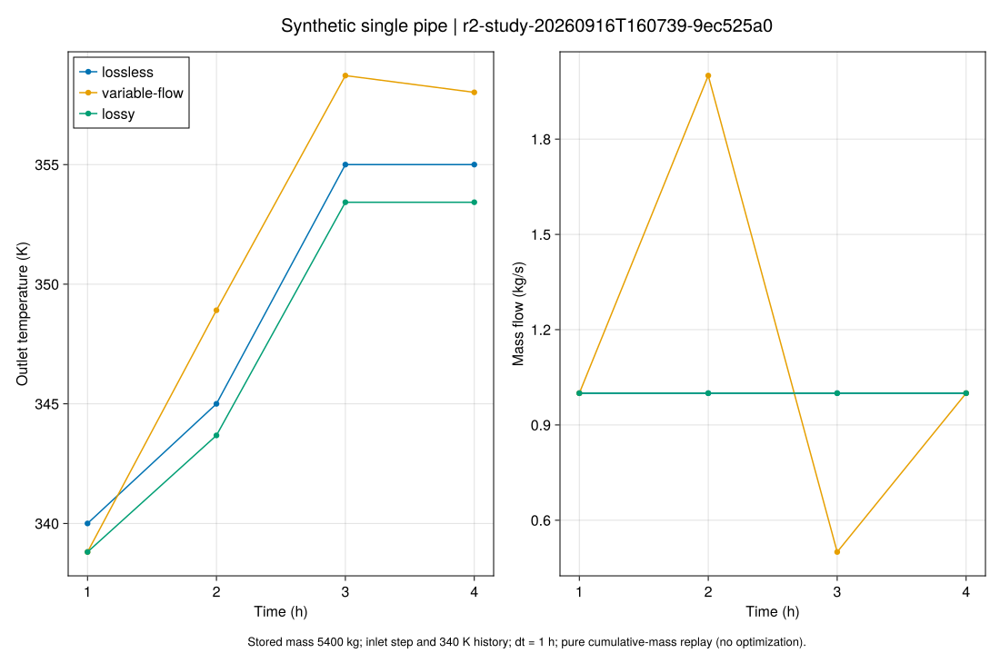
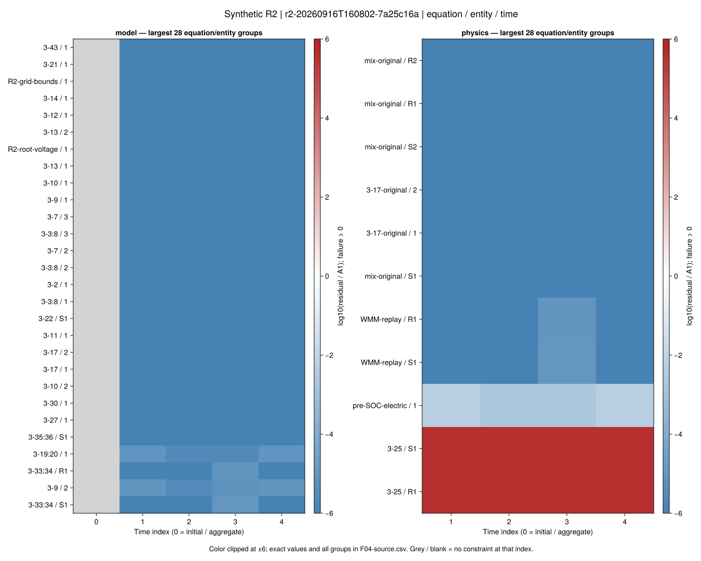
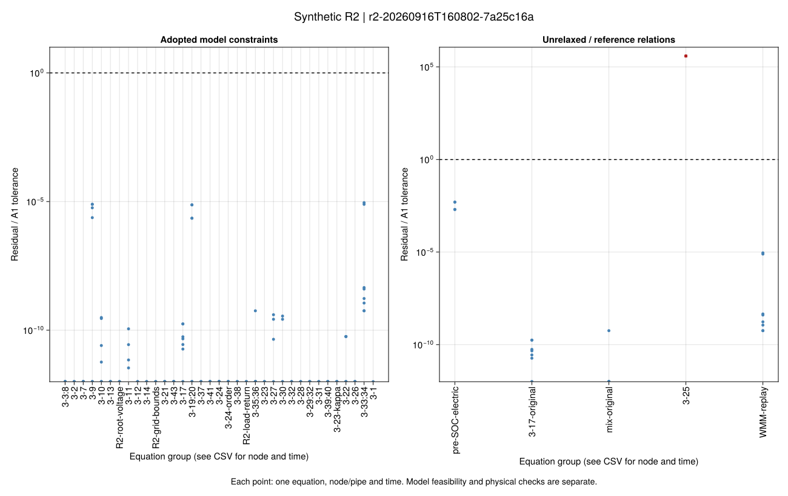
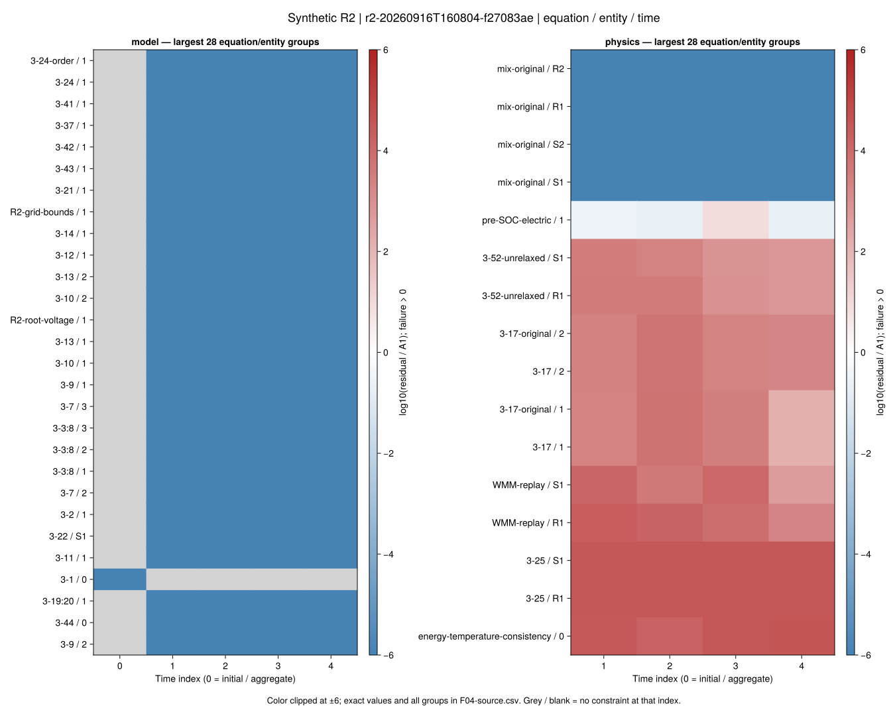
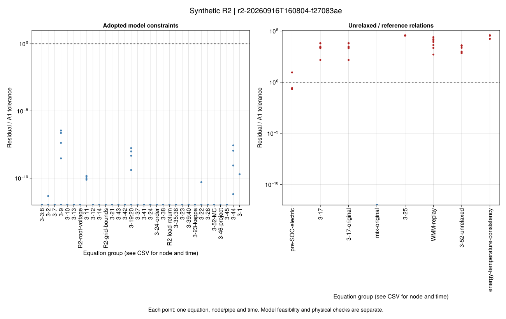
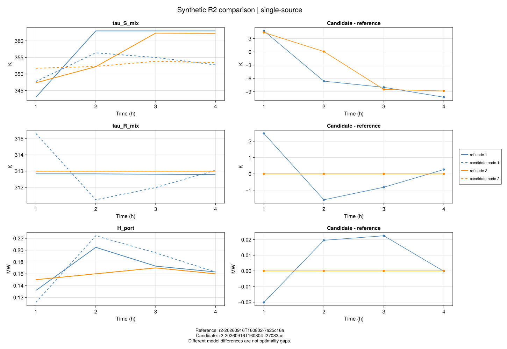
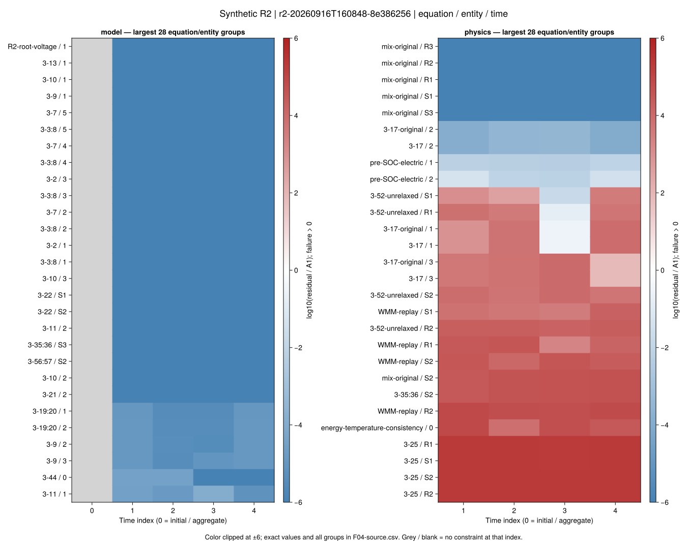
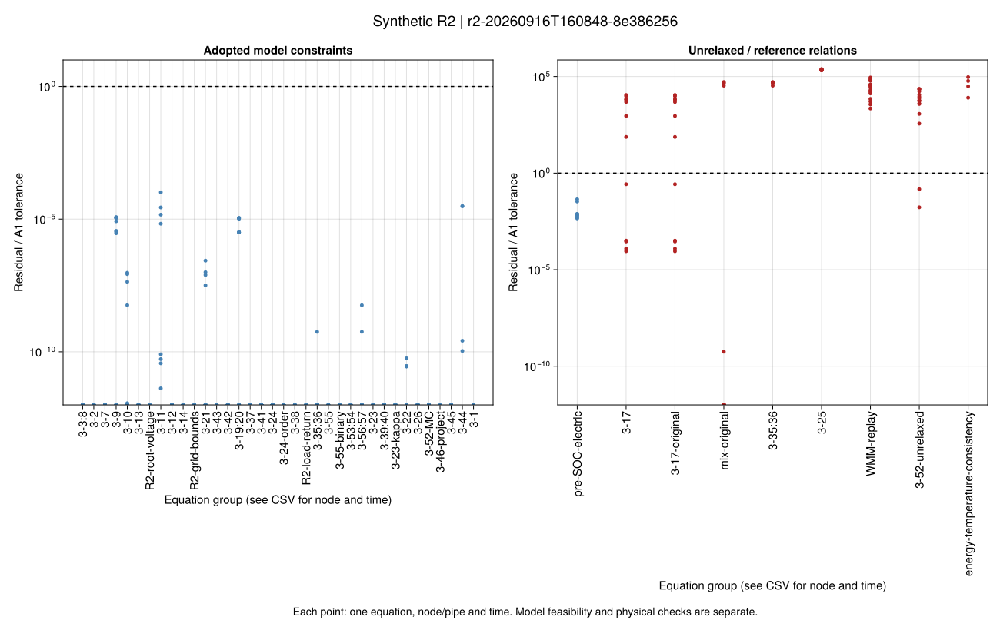
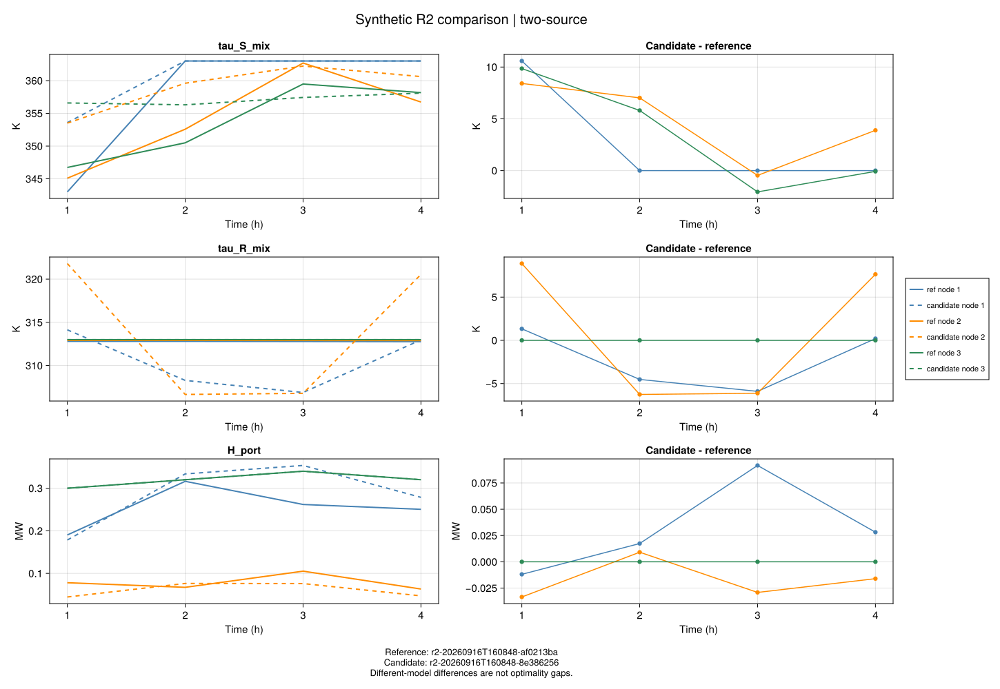

# [R2 首批实验结果](@id ch03-r2-results)

<!-- GENERATED: scripts/report_r2.jl; evidence in results/summaries/r2-first-batch. -->

批次：`r2-study-20260916T160739-9ec525a0`；**全部为合成案例**，每实例预算60.0秒。单线程、种子0；计时从进入solve_r2_case开始，包含内部建模与求解。进程启动/包加载及验证绘图另计，本批不作速度结论。

成本使用合成计价单位（单价/ MWh × MW × h），不对应实际币种，也不与论文成本直接比较。

源证据：`results/summaries/r2-first-batch/r2-study-20260916T160739-9ec525a0-c2eb483c`。公开摘要保留输入/解/哈希与逐式残差；完整日志和源码快照留在本地独立运行目录。

## 模型自身与原物理检查

| 运行 | 停止状态 | 成本 | 模型A1 | 原关系A1 |
| --- | --- | ---: | --- | --- |
| single-fixed-open | solver_optimal | 80.182863 | true | false |
| single-fixed-gurobi | solver_optimal | 80.182865 | true | false |
| single-wmm | solver_optimal | 76.84614 | true | false |
| single-schpd | solver_optimal | 72.499392 | true | false |
| two-wmm | solver_optimal | 177.376248 | true | false |
| two-schpd | solver_optimal | 167.638706 | true | false |
| two-fixed-enumeration | solver_optimal | 176.044759 | true | false |
| two-fixed-mip | solver_optimal | 176.04476 | true | false |
| ablation-heat-envelope | solver_optimal | 65.008381 | true | false |
| ablation-reference-loss | solver_optimal | 76.844445 | true | false |
| ablation-temperature | solver_optimal | 77.404848 | true | false |
| ablation-mixing | solver_optimal | 163.596812 | true | false |
| literal-wmm | blocked | — | false | false |
| literal-schpd | blocked | — | false | false |

`false`不被隐藏：literal是原式阻断；有解运行的物理失败必须阅读残差分项，尤其水压锥松弛3-25、WMM回放、热功率乘积与混合温度。

## 默认版本的物理失败定位

| 运行 | 关系 | 节点/管道 | 时段 | 最大残差 | 单位 | A1阈值 |
| --- | --- | --- | ---: | ---: | --- | ---: |
| single-wmm | 3-25 | R1 | 4 | 0.38776 | normalized | 1.0e-6 |
| single-schpd | pre-SOC-electric | 1 | 3 | 9.0136e-6 | pu | 1.0e-6 |
| single-schpd | 3-17 | 1 | 2 | 0.019708 | MW | 3.0e-6 |
| single-schpd | 3-17-original | 1 | 2 | 0.019708 | MW | 3.0e-6 |
| single-schpd | 3-25 | R1 | 1 | 0.036752 | normalized | 1.0e-6 |
| single-schpd | WMM-replay | R1 | 1 | 2.4935 | K | 0.0001 |
| single-schpd | 3-52-unrelaxed | R1 | 1 | 0.011797 | MW | 3.0e-6 |
| single-schpd | energy-temperature-consistency | 0 | 4 | 0.041757 | MWh | 1.0840000000000001e-6 |
| two-wmm | 3-25 | S2 | 4 | 0.2257 | normalized | 1.0e-6 |
| two-schpd | 3-17 | 3 | 3 | 0.033159 | MW | 3.0e-6 |
| two-schpd | 3-17-original | 3 | 3 | 0.033159 | MW | 3.0e-6 |
| two-schpd | 3-35:36 | S2 | 4 | 5.2158 | K | 0.0001 |
| two-schpd | mix-original | S2 | 4 | 5.2158 | K | 0.0001 |
| two-schpd | 3-25 | R2 | 3 | 0.24209 | normalized | 1.0e-6 |
| two-schpd | WMM-replay | R2 | 1 | 8.9008 | K | 0.0001 |
| two-schpd | 3-52-unrelaxed | R2 | 4 | 0.068631 | MW | 3.0e-6 |
| two-schpd | energy-temperature-consistency | 0 | 1 | 0.10912 | MWh | 1.1679999999999999e-6 |

完整失败位置见`physical-failures.csv`及各运行`residuals.csv`。阈值未随结果放宽。

## 同模型对照与近似分项

| 参考 → 对照 | 同模型 | 成本差 | 温度最大差 S/R (K) | A2 |
| --- | --- | ---: | ---: | --- |
| single-fixed-open → single-fixed-gurobi | true | 2.0e-6 | 0.0 / 0.0 | true |
| two-fixed-enumeration → two-fixed-mip | true | 1.0e-6 | 0.0 / 0.0 | true |
| single-wmm → single-schpd | false | -4.346748 | 10.24637 / 2.4779 | 不适用 |
| two-wmm → two-schpd | false | -9.737542 | 10.58412 / 8.88636 | 不适用 |
| single-wmm → ablation-heat-envelope | false | -11.837759 | 9.36345 / 0.05966 | 不适用 |
| single-wmm → ablation-reference-loss | false | -0.001696 | 0.47803 / 0.01615 | 不适用 |
| single-wmm → ablation-temperature | false | 0.558708 | 2.44708 / 0.01129 | 不适用 |
| two-wmm → ablation-mixing | false | -13.779436 | 20.0 / 0.04065 | 不适用 |

不同模型的温度差包含优化决策变化，不能全部解释为同一控制轨迹下的纯离散误差；逐运行WMM回放残差另列在F04/CSV。成本差不是最优间隙，松弛/近似低成本不证明经济性。

## 科学图：残差和温度/热功率对照

## 结论边界

项目补全模型的求解、独立回代、同模型对照和绘图流程已执行。原式literal及论文数值匹配仍阻断；电/水松弛等式或热近似检查失败时，不能宣布原调度物理可行。R3的可行性恢复和论文规模数据闭合尚未实施。
