# [R3 首批可行性闭环：实验结果](@id ch03-r3-results)

<!-- GENERATED: scripts/report_r3.jl; do not hand-edit numerical findings. -->

批次：`r3-study-20260917T045811-7399ae72`。**全部为合成案例**；每个完整流程共享600.0秒预算。线程1、种子0，A1门槛未放宽。

源证据：`results/summaries/r3-first-batch/r3-study-20260917T045811-7399ae72-d44a3f58`。公开摘要保留配置、各阶段解、残差及输入/代码哈希；完整源码快照在本地独立运行目录。

成本为合成计价单位，非现实币种。成本优化完成只表示**该固定流量的详细调度**达到求解器最优终止，不是所有流量联合优化的全局最优。

## 最终判定

| 案例 | 状态 | 物理A1 | 固定流量成本完成 | 流量改动D | 成本 | 耗时s |
| --- | --- | --- | --- | ---: | ---: | ---: |
| single-fixed | feasible_cost_optimized | true | true | 0.0 | 80.182863 | 10.875481 |
| single-schpd | feasible_cost_optimized | true | true | 0.012131 | 80.083552 | 5.153522 |
| two-schpd | feasible_cost_optimized | true | true | 0.02784 | 186.388437 | 181.718873 |
| single-low-flow | feasible_cost_optimized | true | true | 1.19303 | 80.970961 | 0.226242 |
| single-impossible-heat | infeasible_certified | false | false | — | — | 0.032367 |
| single-loose-electric | feasible_cost_optimized | true | true | 0.0 | 0.0 | 0.074903 |

计时从流程入口开始，包含阶段建模和求解；启动、包加载、保存和绘图另计。本批不评价算法速度。

## 阶段对照

| 案例 / 阶段 | 停止状态 | 目标类型 | 求解目标 | 运行成本 | 流量D | 模型A1 | 物理A1 |
| --- | --- | --- | ---: | ---: | ---: | --- | --- |
| single-fixed / fixed_dispatch | solver_optimal | operating_cost | 80.182863 | 80.182863 | 0.0 | true | false |
| single-fixed / pressure_reconstruction | solver_optimal | operating_cost | 80.182863 | 80.182863 | 0.0 | true | true |
| single-schpd / initialization | solver_optimal | operating_cost | 72.499392 | 72.499392 | 0.0 | true | false |
| single-schpd / fixed_dispatch | infeasible_certified | operating_cost | — | — | — | false | false |
| single-schpd / diagnostic | solver_optimal | normalized_slack | 0.002128 | 193.928556 | 0.0 | true | false |
| single-schpd / direct_repair | solver_optimal | flow_distance | 0.012131 | 212.343769 | 0.012131 | true | true |
| single-schpd / repaired_dispatch | solver_optimal | operating_cost | 80.083552 | 80.083552 | 0.012131 | true | true |
| two-schpd / initialization | solver_optimal | operating_cost | 167.638709 | 167.638709 | 0.0 | true | false |
| two-schpd / fixed_dispatch | infeasible_certified | operating_cost | — | — | — | false | false |
| two-schpd / diagnostic | solver_optimal | normalized_slack | 0.007753 | 358.077963 | 0.0 | true | false |
| two-schpd / direct_repair | solver_optimal | flow_distance | 0.02784 | 417.500367 | 0.02784 | true | true |
| two-schpd / repaired_dispatch | solver_optimal | operating_cost | 186.388437 | 186.388437 | 0.02784 | true | true |
| single-low-flow / fixed_dispatch | infeasible_certified | operating_cost | — | — | — | false | false |
| single-low-flow / diagnostic | solver_optimal | normalized_slack | 0.250105 | 176.031756 | 0.0 | true | false |
| single-low-flow / direct_repair | solver_optimal | flow_distance | 1.19303 | 215.793263 | 1.19303 | true | true |
| single-low-flow / repaired_dispatch | solver_optimal | operating_cost | 80.970961 | 80.970961 | 1.19303 | true | true |
| single-impossible-heat / fixed_dispatch | infeasible_certified | operating_cost | — | — | — | false | false |
| single-impossible-heat / diagnostic | solver_optimal | normalized_slack | 3.919086 | 187.316541 | 0.0 | true | false |
| single-impossible-heat / direct_repair | infeasible_certified | flow_distance | — | — | — | false | false |
| single-loose-electric / fixed_dispatch | solver_optimal | operating_cost | -0.0 | -0.0 | 0.0 | true | false |
| single-loose-electric / pressure_reconstruction | solver_optimal | operating_cost | -0.0 | -0.0 | 0.0 | true | false |
| single-loose-electric / fixed_physical | solver_optimal | operating_cost | 0.0 | 0.0 | 0.0 | true | true |

目标界及实际间隙见`stages.csv`和每阶段原始TOML。`flow_distance`与`normalized_slack`的界不能解释为费用界；不同阶段的费用差也不是最优间隙。

## 怎样解释这些结果

- SCHPD阶段是初值，其热关系误差保留在失败表；最终只接受详细模型及松弛前关系全部通过的候选。
- 低流量例只说明边界内的流量仍可能无法供热；弹性目标大于零用于定位冲突，诊断解不能执行。
- 容量反例负荷为10 MW；管道及端口上界1.5 kg/s、供水上界363 K、负荷回水313 K，对应端口上限0.315 MW，已在优化前构造为不可恢复。
- 免费购电边界例移除网损的价格惩罚，用于检查电网锥不取等时的固定流量详细求解分支；这不是论文运行模式。
- `infeasible_certified`与`time_limit_no_solution`、`repair_unresolved`分别保留。失败细目见`failures.csv`；无数值解的阶段不能画出残差。

## 科学图 F04 / F05

F04覆盖全部阶段并标出A1阈值；详细图按公式、实体、时段展示最差24组，完整记录在图源CSV。F05对比初值/首个有解阶段与最终候选，虚线为独立质量回放。图中的阶段顺序不是梯度迭代。

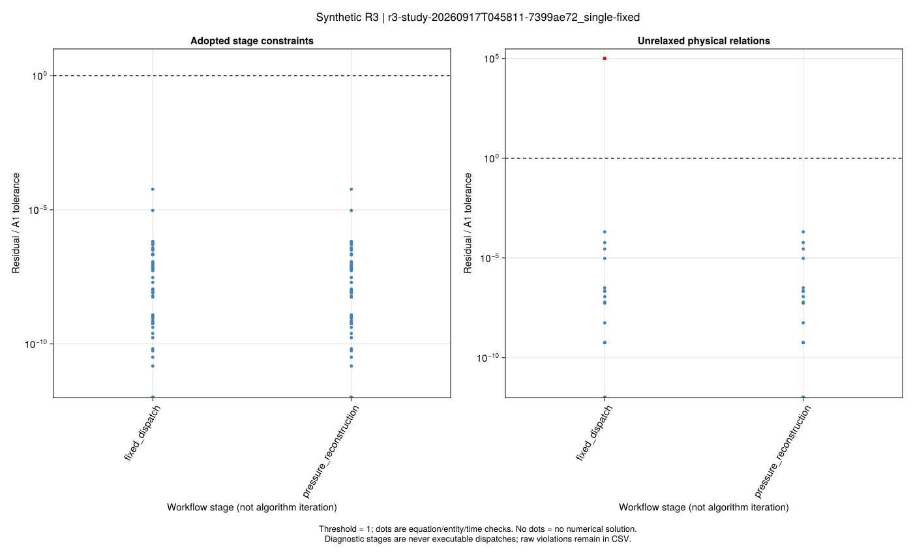

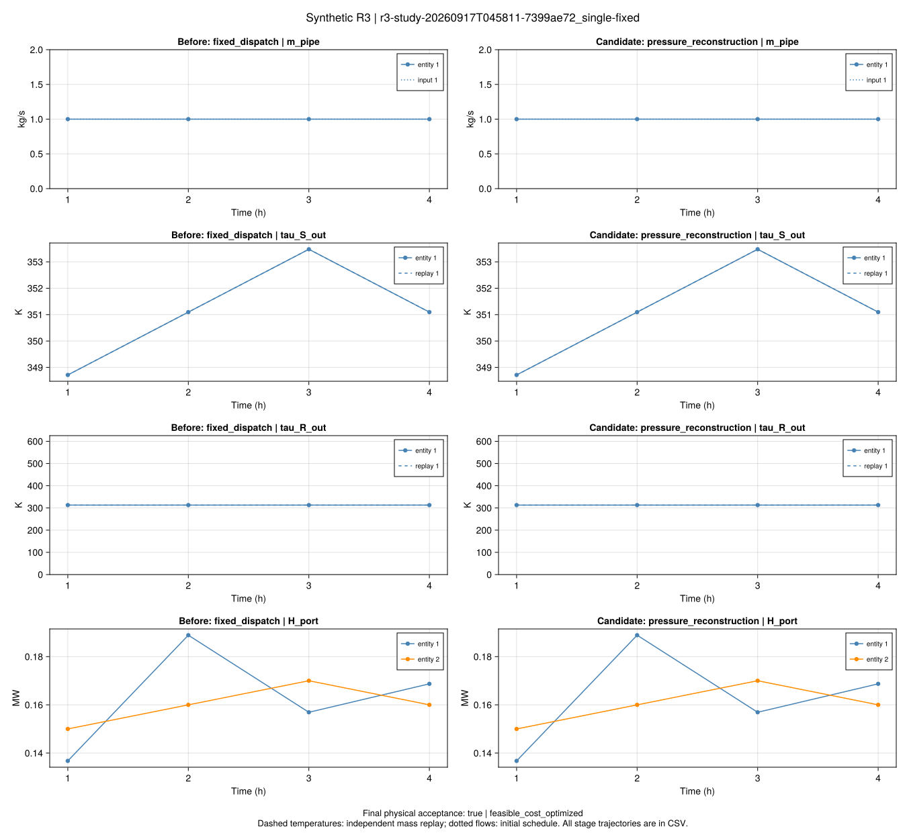

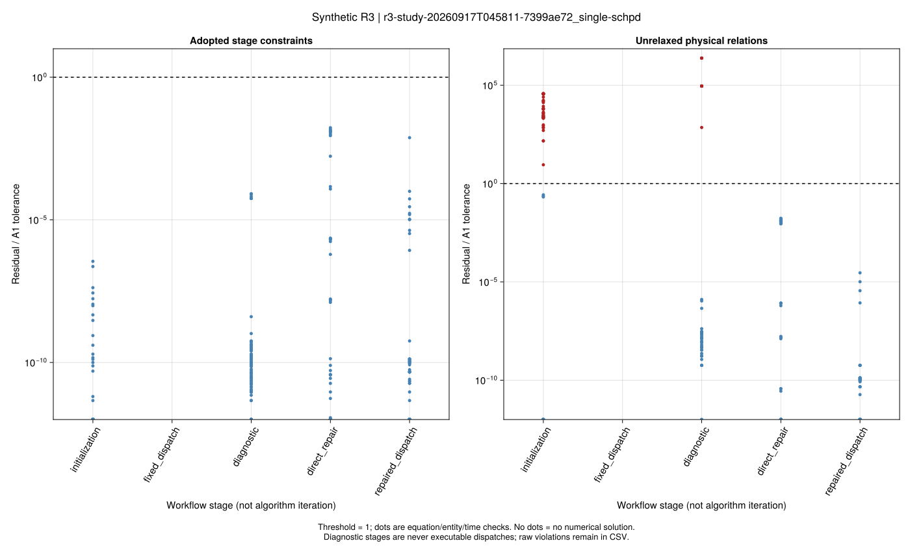

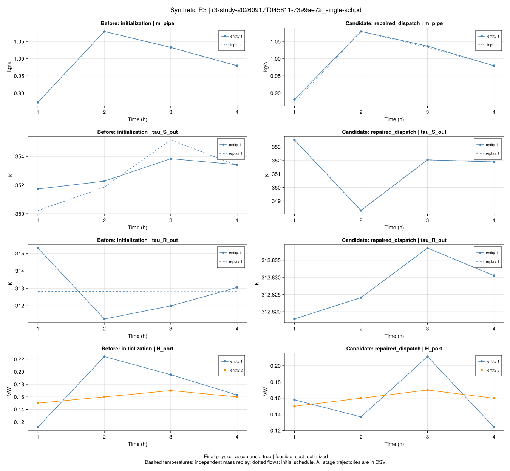

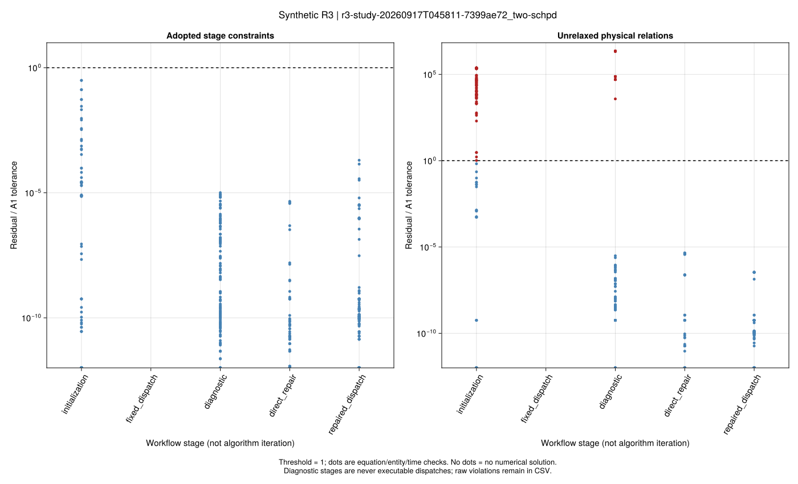

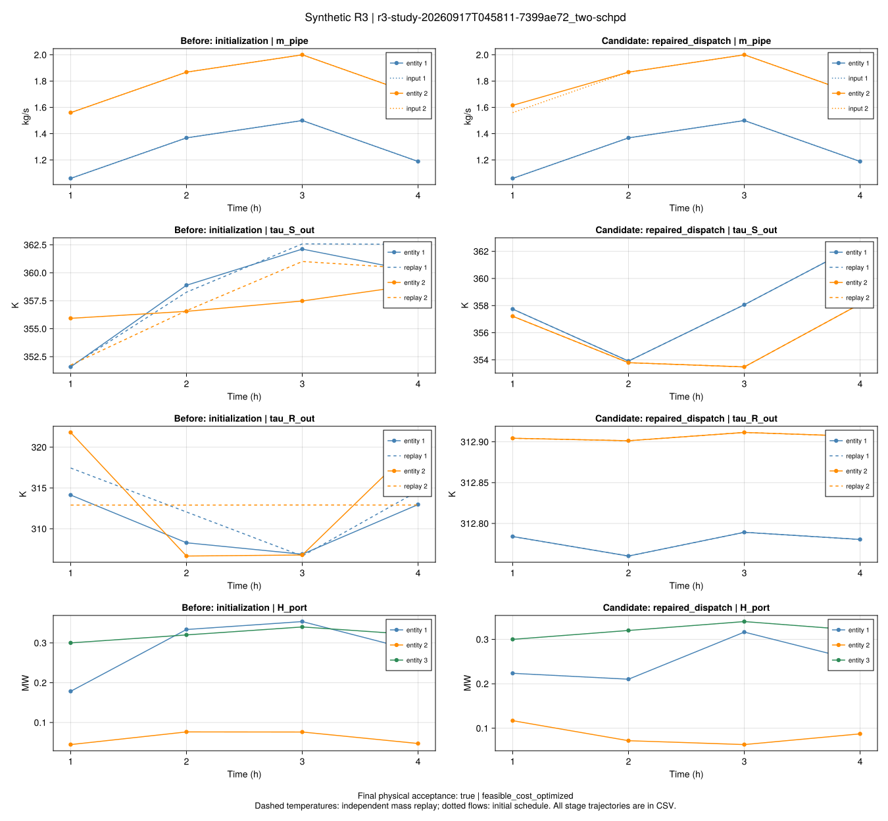

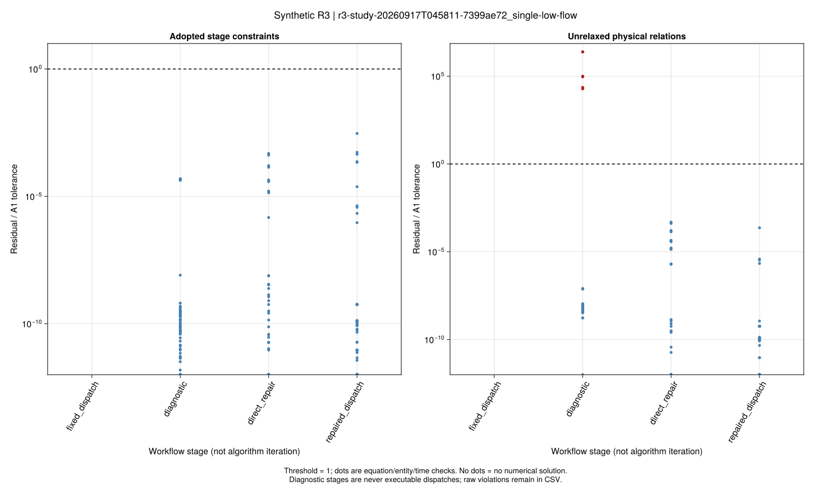

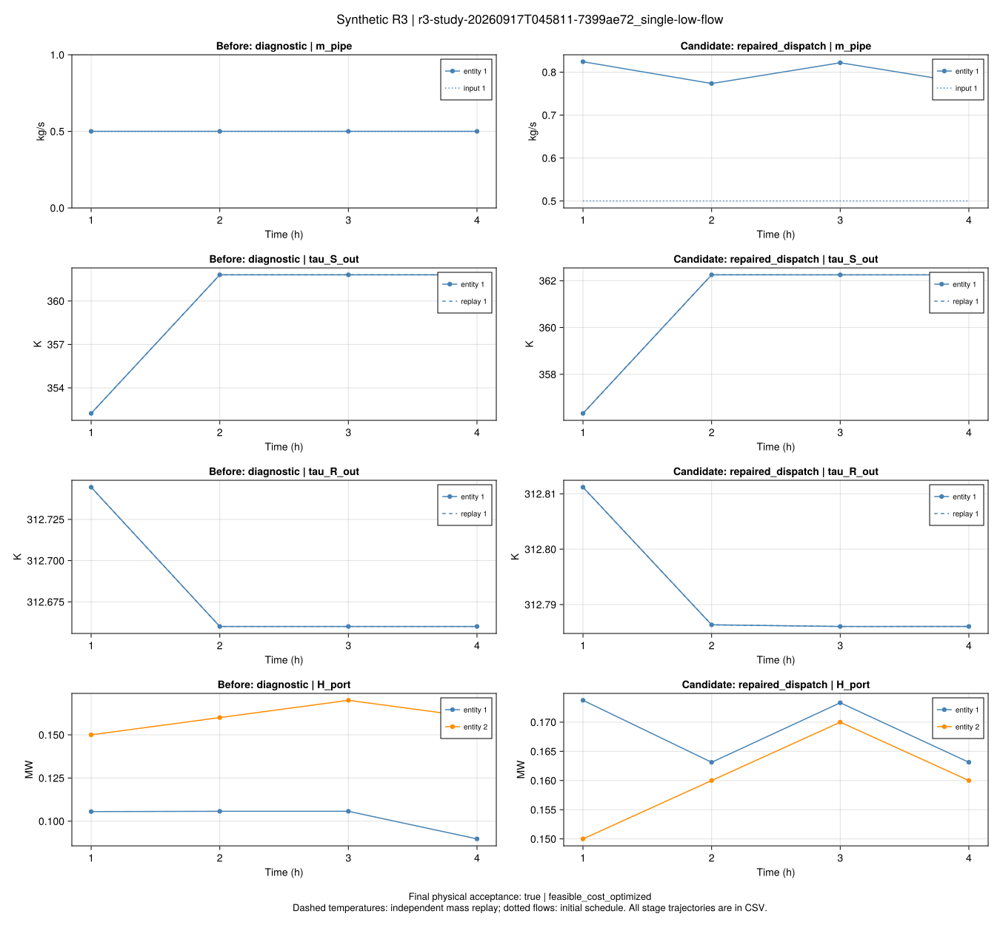

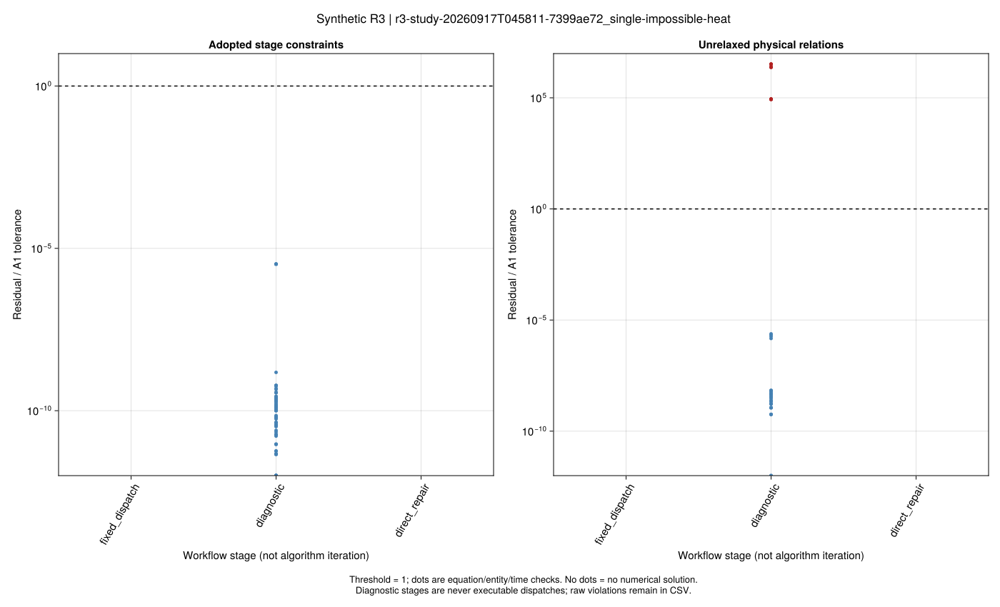

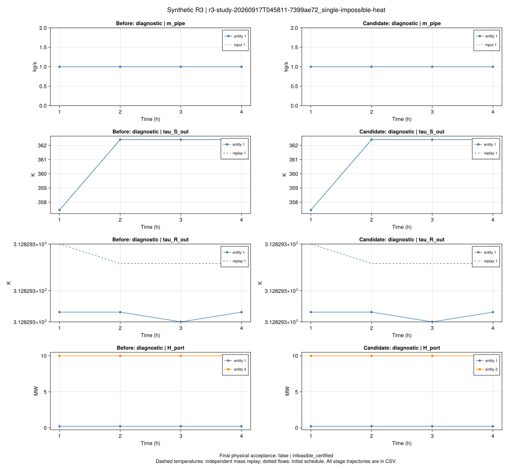

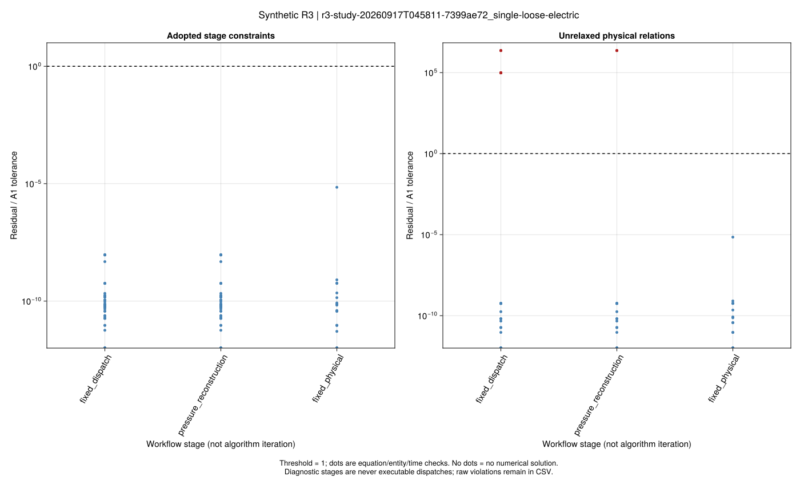

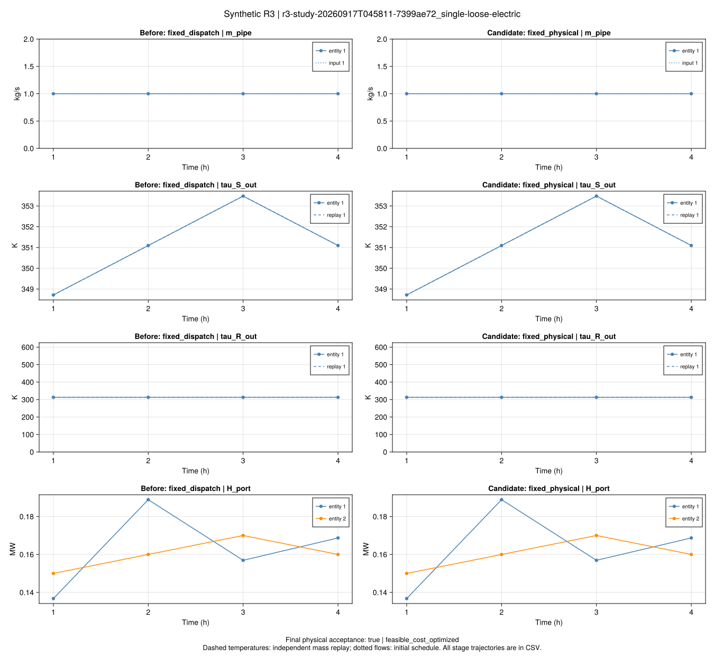

## 交付边界

已建立项目可行性闭环；原式台账覆盖3-1至3-66，但梯度、割平面与投影仍未实现。没有论文同输入数值匹配、完整四模式或论文规模性能证据，不生成F06/F07结论。下一批应在本批固定流量和诊断接口上推导可验证的灵敏度及投影更新。
